# GitHub Copilot Spec 駆動開発 - プロジェクト構造

## 📋 ドキュメント一覧

### ユーザー向けドキュメント

- [README.md](README.md) - クイックスタートガイド
- [GUIDE.md](GUIDE.md) - 完全ガイド（詳細な使い方とベストプラクティス）
- [LICENSE](LICENSE) - ライセンス情報

### AI 向け設定

- [.github/copilot-instructions.md](.github/copilot-instructions.md) - GitHub Copilot AI 指示

---

## 🏗️ ディレクトリ構造

### コアディレクトリ

```text
.
├── .github/                         # GitHub & Copilot 設定
│   ├── copilot-instructions.md     # AI指示（リポジトリ全体）
│   ├── chatmodes/                  # カスタムチャットモード
│   ├── prompts/                    # 再利用可能プロンプト
│   └── instructions/               # パス固有の指示
│
├── .specify/                        # Spec駆動開発コア
│   ├── templates/                  # 各種テンプレート
│   └── scripts/                    # ヘルパースクリプト
│
├── memory/                          # プロジェクトメモリ
│   ├── constitution.md             # 開発原則
│   └── project-status.md           # 進捗管理
│
├── specs/                           # 機能仕様（自動生成）
│   └── [###-feature-name]/         # 機能ごとのディレクトリ
│
├── docs/                            # プロジェクトドキュメント
│   ├── features/                   # 機能説明
│   └── research/                   # 調査資料
│
└── .vscode/                         # VS Code設定
    ├── settings.json               # Copilot統合設定
    └── extensions.json             # 推奨拡張機能
```

---

## 📝 ファイル分類

### 1. GitHub Copilot カスタマイズ

#### カスタムインストラクション

| ファイル                                              | スコープ               | 用途               |
| ----------------------------------------------------- | ---------------------- | ------------------ |
| `.github/copilot-instructions.md`                     | リポジトリ全体         | 基本動作指示       |
| `.github/instructions/specs.instructions.md`          | `specs/**/*.md`        | 仕様書作成ルール   |
| `.github/instructions/implementation.instructions.md` | `src/**/*`, `lib/**/*` | 実装コードルール   |
| `.github/instructions/tests.instructions.md`          | `test/**/*`            | テストコードルール |

#### チャットモード

| ファイル                                       | モード名            | 用途       |
| ---------------------------------------------- | ------------------- | ---------- |
| `.github/chatmodes/spec.chatmode.md`           | Spec Mode           | 仕様書作成 |
| `.github/chatmodes/planning.chatmode.md`       | Planning Mode       | プラン作成 |
| `.github/chatmodes/implementation.chatmode.md` | Implementation Mode | 実装       |
| `.github/chatmodes/review.chatmode.md`         | Review Mode         | レビュー   |

#### プロンプト

| ファイル                                   | プロンプト名   | 用途             |
| ------------------------------------------ | -------------- | ---------------- |
| `.github/prompts/task-breakdown.prompt.md` | Task Breakdown | タスク分解       |
| `.github/prompts/code-review.prompt.md`    | Code Review    | コードレビュー   |
| `.github/prompts/documentation.prompt.md`  | Documentation  | ドキュメント生成 |

---

### 2. Spec 駆動開発テンプレート

#### テンプレートファイル

| ファイル                               | 用途               |
| -------------------------------------- | ------------------ |
| `.specify/templates/spec-template.md`  | 仕様書の雛形       |
| `.specify/templates/plan-template.md`  | プランの雛形       |
| `.specify/templates/tasks-template.md` | タスクリストの雛形 |

#### コマンド定義

| ファイル                                   | コマンド          | 機能       |
| ------------------------------------------ | ----------------- | ---------- |
| `.specify/templates/commands/specify.md`   | `/ikak:specify`   | 仕様書作成 |
| `.specify/templates/commands/plan.md`      | `/ikak:plan`      | プラン生成 |
| `.specify/templates/commands/tasks.md`     | `/ikak:tasks`     | タスク分解 |
| `.specify/templates/commands/implement.md` | `/ikak:implement` | 実装       |
| `.specify/templates/commands/status.md`    | `/ikak:status`    | 状態確認   |

#### ヘルパースクリプト

| ファイル                               | 用途             |
| -------------------------------------- | ---------------- |
| `.specify/scripts/setup-plan.sh`       | プラン作成補助   |
| `.specify/scripts/get-feature-docs.sh` | ドキュメント取得 |

---

### 3. 仕様ファイル構成

各機能は `specs/###-feature-name/` 配下に以下のファイルを持ちます：

#### 必須ファイル

| ファイル   | 生成コマンド    | 内容                       |
| ---------- | --------------- | -------------------------- |
| `spec.md`  | `/ikak:specify` | ユーザーストーリー、要件   |
| `plan.md`  | `/ikak:plan`    | 実装プラン、アーキテクチャ |
| `tasks.md` | `/ikak:tasks`   | 実装タスクリスト           |

#### 自動生成ファイル

| ファイル        | 生成コマンド | 内容                    |
| --------------- | ------------ | ----------------------- |
| `research.md`   | `/ikak:plan` | 技術調査、選定理由      |
| `data-model.md` | `/ikak:plan` | エンティティ定義、ER 図 |
| `quickstart.md` | `/ikak:plan` | API 使用例              |
| `contracts/`    | `/ikak:plan` | API 仕様、契約定義      |

---

### 4. プロジェクトメモリ

| ファイル                   | 用途           | 更新タイミング |
| -------------------------- | -------------- | -------------- |
| `memory/constitution.md`   | 開発原則の定義 | 手動           |
| `memory/project-status.md` | 進捗管理       | `/ikak:status` |

---

## 🔄 開発ワークフロー

```mermaid
graph LR
    A["/ikak:specify"] --> B["spec.md"]
    B --> C["/ikak:plan"]
    C --> D["plan.md + 設計ドキュメント"]
    D --> E["/ikak:tasks"]
    E --> F["tasks.md"]
    F --> G["/ikak:implement"]
    G --> H["実装コード"]
```



### フェーズ別成果物

| フェーズ     | コマンド          | 入力                 | 出力                                                                     |
| ------------ | ----------------- | -------------------- | ------------------------------------------------------------------------ |
| **仕様化**   | `/ikak:specify`   | 機能説明             | `spec.md`                                                                |
| **計画**     | `/ikak:plan`      | 技術スタック         | `plan.md`, `research.md`, `data-model.md`, `contracts/`, `quickstart.md` |
| **タスク化** | `/ikak:tasks`     | `spec.md`, `plan.md` | `tasks.md`                                                               |
| **実装**     | `/ikak:implement` | タスク ID            | 実装コード                                                               |
| **確認**     | `/ikak:status`    | -                    | 進捗レポート                                                             |

---

## 🎯 コマンドクイックリファレンス

### 基本コマンド

```text
/ikak:specify [機能説明]           # 仕様書作成
/ikak:plan [技術スタック]          # プラン生成
/ikak:tasks                       # タスク分解
/ikak:implement [タスクID]         # 実装
/ikak:status                      # 状態確認
```

### 実装オプション

```text
/ikak:implement T001              # タスク単位
/ikak:implement US1               # ユーザーストーリー単位
/ikak:implement Phase 3           # フェーズ単位
```

### 計画変更対応

```text
/ikak:plan --replan              # プラン再生成
/ikak:tasks --preserve-completed  # 完了タスクを保持
```

---

## 📊 タスク形式規則

すべてのタスクは以下の形式に従います：

```markdown
- [ ] [T###] [P?] [USX?] Action in path/to/file.ext
```

### タスク要素

| 要素               | 説明                       | 例                    |
| ------------------ | -------------------------- | --------------------- |
| `T###`             | タスク ID（連番）          | `T001`, `T015`        |
| `[P]`              | 並列実行可能（任意）       | `[P]`                 |
| `[USX]`            | ユーザーストーリー（任意） | `[US1]`               |
| `Action`           | 具体的なアクション         | `Create`, `Implement` |
| `path/to/file.ext` | 対象ファイルパス           | `src/models/user.py`  |

### タスク例

```markdown
## Setup [US1]

- [ ] [T001] [P] Setup database schema in migrations/001_users.sql
- [ ] [T002] [P] [US1] Create User model in src/models/user.py

## Core Features [US1]

- [ ] [T003] [US1] Implement registration endpoint in src/api/auth.py
  - Depends: T001, T002
```

---

## 📚 ドキュメント詳細

### docs/features/ - 機能説明

- [adaptive-replanning.md](docs/features/adaptive-replanning.md) - 途中計画変更対応
- [critical-dialogue.md](docs/features/critical-dialogue.md) - クリティカル対話
- [debug-driven-fixing.md](docs/features/debug-driven-fixing.md) - デバッグ駆動修正
- [flexible-principles.md](docs/features/flexible-principles.md) - 柔軟な原則
- [github-integration.md](docs/features/github-integration.md) - GitHub 統合
- [multilingual.md](docs/features/multilingual.md) - 多言語対応
- [progressive-adoption.md](docs/features/progressive-adoption.md) - 段階的導入
- [triple-memory.md](docs/features/triple-memory.md) - トリプルメモリ

### docs/research/ - 調査資料

- [github-copilot-customization.md](docs/research/github-copilot-customization.md) - Copilot カスタマイズ機能
- [github-copilot-customization-detailed.md](docs/research/github-copilot-customization-detailed.md) - 詳細ガイド
- [spec-kit-analysis.md](docs/research/spec-kit-analysis.md) - spec-kit 分析
- [comparison.md](docs/research/comparison.md) - 類似ツール比較
- [unique-value-proposition.md](docs/research/unique-value-proposition.md) - 独自の価値提案

---

## 🔗 関連リンク

### 公式ドキュメント

- [GitHub Copilot Documentation](https://docs.github.com/copilot)
- [VS Code Copilot Customization](https://code.visualstudio.com/docs/copilot/copilot-customization)
- [GitHub spec-kit](https://github.com/github/spec-kit)

### プロジェクトドキュメント

- [クイックスタート (README.md)](README.md)
- [完全ガイド (GUIDE.md)](GUIDE.md)

---

## 📊 プロジェクト統計

- **コマンド数**: 5 (`specify`, `plan`, `tasks`, `implement`, `status`)
- **チャットモード数**: 4 (Spec, Planning, Implementation, Review)
- **プロンプト数**: 3 (Task Breakdown, Code Review, Documentation)
- **インストラクション数**: 4 (リポジトリ全体 + specs + implementation + tests)

---

**最終更新**: 2025 年 1 月 11 日  
**バージョン**: 1.0.0
