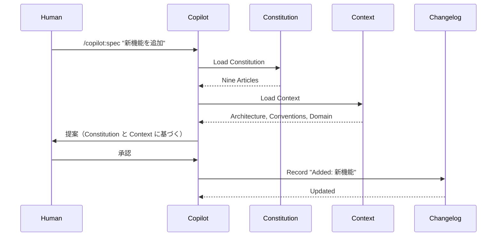
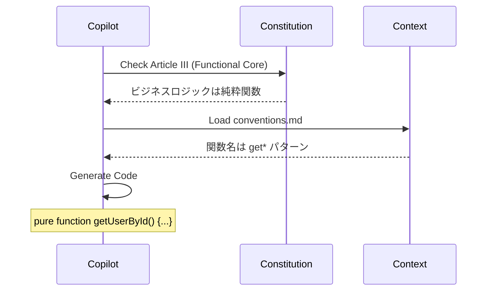
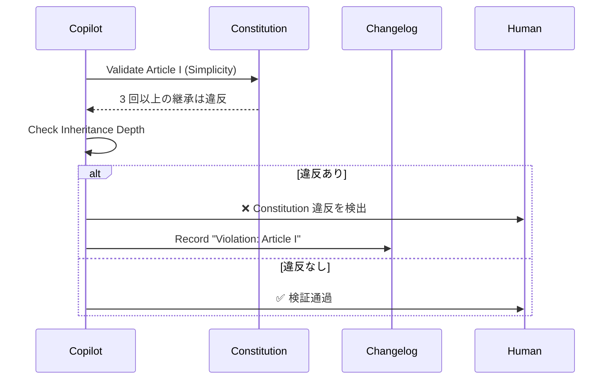

# Triple Memory Architecture

三層記憶アーキテクチャ

## 概要

Constitution（不変の原則）、Context（可変の記憶）、Changelog（変更履歴）の 3 層でプロジェクトの記憶を管理するアーキテクチャです。AI がセッションを跨いでプロジェクトの知識を保持できます。

## 背景：なぜ必要か

### 問題：AI の記憶喪失

```
Day 1:
人間: 「このプロジェクトは関数型プログラミングで書いてください」
AI: 「了解しました」
[関数型スタイルで実装]

Day 2（新しいセッション）:
人間: 「新しい機能を追加してください」
AI: 「了解しました」
[クラスベースで実装してしまう] ← 前回のルールを忘れている！

人間: 「関数型で書くって言ったのに...」
AI: 「申し訳ございません。記憶にありませんでした」
```

**問題点**:

- AI はセッションごとに記憶をリセット
- 毎回同じことを説明しなければならない
- プロジェクトの一貫性が保てない

### 既存フレームワークの限界

| フレームワーク | 記憶システム      | 問題点                                         |
| -------------- | ----------------- | ---------------------------------------------- |
| spec-kit       | Constitution のみ | 原則は記録できるが、具体的な知識は記録できない |
| OpenSpec       | なし              | セッション間の記憶なし                         |
| cc-sdd         | Steering のみ     | 原則の強制力が弱い                             |

### 三層記憶の解決策

```
【第一層】Constitution（不変の原則）
→ プロジェクトの憲法。絶対に守るべきルール

【第二層】Context（可変の記憶）
→ アーキテクチャ、規約、ドメイン知識など、進化する記憶

【第三層】Changelog（変更履歴）
→ 何をいつ変更したかのメタデータ
```

**メリット**:

- 原則と記憶を分離管理
- セッション間で知識が保持される
- 変更履歴を追跡できる

## 三層の役割

### 第一層：Constitution（憲法）

#### 役割

**「絶対に守るべき不変の原則」を記録**

#### 特徴

- ✅ プロジェクト開始時に一度だけ定義
- ✅ 変更にはチーム全員の合意が必要
- ✅ 違反時は強制的にブロック
- ✅ spec-kit の Nine Articles を参考

#### 内容例

```markdown
# Constitution

## Article I: Simplicity First

過度な抽象化を禁止する。3 回以上の継承は違反。

## Article II: Anti-Pattern Gate

以下のパターンは禁止：

- God Object（1000 行以上のクラス）
- Shotgun Surgery（1 つの変更で 10 ファイル以上修正）
- Magic Number（定数化されていない数値）

## Article III: Functional Core, Imperative Shell

ビジネスロジックは純粋関数で実装。副作用は Shell 層に限定。

## Article IV: Test-First

実装前にテストを書く。テストがない PR は拒否。

## Article V: Documentation as Code

ドキュメントは Markdown でコードと同じリポジトリに配置。

## Article VI: Single Source of Truth

GitHub を唯一の真実の源とする。外部ツールに情報を分散させない。

## Article VII: Open Source First

すべての意思決定を公開。企業利益よりコミュニティ利益を優先。

## Article VIII: Progressive Disclosure

情報は段階的に開示。初心者向けと上級者向けを分ける。

## Article IX: Fail Fast, Learn Fast

失敗を恐れず実験する。失敗を記録して学びを共有。
```

#### 使用方法

```bash
# Constitution をロード
/copilot:memory load constitution

# Constitution 違反をチェック
/copilot:validate --constitution

# Constitution を更新（要チーム承認）
/copilot:memory update constitution
```

### 第二層：Context（コンテキスト）

#### 役割

**「プロジェクト固有の可変の知識」を記録**

#### 特徴

- ✅ プロジェクトの進行に応じて進化
- ✅ いつでも追加・更新可能
- ✅ AI がセッション間で参照
- ✅ cc-sdd の Steering を参考

#### ディレクトリ構造

```
.github/memory/context/
├── architecture.md      # アーキテクチャ決定記録
├── conventions.md       # コーディング規約
├── domain.md            # ドメイン知識
├── tech-stack.md        # 技術スタック詳細
├── apis.md              # 外部 API 仕様
└── custom/              # プロジェクト固有知識
    ├── payment.md       # 決済システムの知識
    └── notification.md  # 通知システムの知識
```

#### 内容例：architecture.md

```markdown
# Architecture Decision Record

## レイヤードアーキテクチャ
```

presentation/ → UI 層（React）
├── components/
└── pages/

application/ → アプリケーション層（ビジネスロジック）
├── use-cases/
└── services/

domain/ → ドメイン層（純粋関数）
├── entities/
└── value-objects/

infrastructure/ → インフラ層（副作用）
├── repositories/
└── adapters/

```

## 依存性逆転の原則（DIP）

- application/ は domain/ に依存
- infrastructure/ は application/ に依存
- 上位層が下位層に依存してはならない

## データフロー

```

User Input → Presentation → Application → Domain → Infrastructure
↓
(View Model)
↑
Infrastructure → Domain → Application → Presentation → User Output

```

## なぜこのアーキテクチャを選んだか

### Goal との整合性
- Goal: 長期的な保守性
- レイヤー分離により、変更の影響範囲を限定

### Constraint との整合性
- Constraint: React + Node.js
- React は Presentation 層、Node.js は Application/Infrastructure 層に配置

### 変更履歴
- 2025-11-01: 初版作成
- 2025-11-05: Infrastructure 層を追加（外部 API 統合のため）
```

#### 内容例：conventions.md

````markdown
# Coding Conventions

## 命名規則

### ファイル名

- コンポーネント: PascalCase（例: `UserProfile.tsx`）
- ユーティリティ: kebab-case（例: `format-date.ts`）
- テスト: `*.test.ts` または `*.spec.ts`

### 変数名

- 定数: UPPER_SNAKE_CASE（例: `MAX_RETRY_COUNT`）
- 関数: camelCase（例: `getUserById`）
- クラス: PascalCase（例: `UserService`）
- プライベート: `_` prefix（例: `_internalMethod`）

### 関数名のパターン

- 取得: `get*`（例: `getUserById`）
- 作成: `create*`（例: `createUser`）
- 更新: `update*`（例: `updateUser`）
- 削除: `delete*` または `remove*`
- 判定: `is*` / `has*` / `can*`

## コメントルール

### DO

```typescript
// ❌ 悪い例（コードを繰り返している）
// ユーザーIDを取得する
const userId = user.id;

// ✅ 良い例（なぜそうするかを説明）
// API の制約上、user.id ではなく user.uid を使用
const userId = user.uid;
```
````

### DON'T

- 自明なコメントは書かない
- コメントアウトされたコードを残さない
- TODO コメントは Issue 化する

## ESLint ルール

- Base: Airbnb
- Max line length: 100
- Max function length: 50 lines
- Max file length: 300 lines

## なぜこの規約を選んだか

- Airbnb は業界標準（学習コスト低）
- 行数制限で可読性向上
- チーム全員が同意（2025-11-01 決定）

````

#### 使用方法

```bash
# Context をロード
/copilot:memory load context

# 特定のファイルのみロード
/copilot:memory load context/architecture.md

# Context を更新
/copilot:memory update context/conventions.md

# Context を追加
/copilot:memory add context/custom/payment.md
````

### 第三層：Changelog（変更履歴）

#### 役割

**「いつ、何を、なぜ変更したか」のメタデータを記録**

#### 特徴

- ✅ 自動生成（Git コミットと連動）
- ✅ 変更理由を記録
- ✅ OpenSpec の Delta Specs と連携
- ✅ 検索・フィルタリング可能

#### 内容例

````markdown
# Changelog

## [2025-11-11] Added: DDF ログ記録機能

### 変更内容

- `.github/specs/*/.ddf-log.md` を自動生成
- PR 作成時に DDF ログを自動挿入

### 変更理由

- Goal: AI の説明性向上（根本原因の記録）
- バグ修正の透明性を高めるため

### 影響範囲

- PR テンプレートに DDF セクション追加
- GitHub Actions に DDF チェック追加

### 関連 Issue

- #123: DDF 機能の実装

---

## [2025-11-10] Modified: API エンドポイント数制約

### 変更前

```yaml
Constraint:
  api_endpoints: 5
```
````

### 変更後

```yaml
Constraint:
  api_endpoints: 3 # パフォーマンス改善のため削減
```

### 変更理由

- Goal: レスポンスタイム 200ms 以下
- エンドポイント数削減により、API Gateway の負荷軽減

### 影響範囲

- 既存の 5 エンドポイントを 3 に統合
- `/api/users/profile` と `/api/users/settings` を `/api/users/:id` に統合

---

## [2025-11-09] Removed: SMS 送信機能

### 変更内容

- SMS 送信コードを削除
- Twilio SDK を package.json から削除

### 変更理由

- Constraint: コスト削減（月 $100 → $0）
- Goal: 問い合わせ削減には寄与していなかった（使用率 1%未満）

### 影響範囲

- パスワードリセットはメールのみに統一
- 通知設定から SMS オプションを削除

````

#### 自動生成

```yaml
# .github/workflows/changelog-update.yml
name: Update Changelog
on:
  pull_request:
    types: [closed]
    branches: [main]

jobs:
  update:
    if: github.event.pull_request.merged == true
    runs-on: ubuntu-latest
    steps:
      - uses: actions/checkout@v3

      - name: Extract Change Info
        id: change
        run: |
          # PR の本文から変更情報を抽出
          CHANGE_TYPE=$(echo "${{ github.event.pull_request.body }}" | grep "## Change Type" | sed 's/.*: //')
          REASON=$(echo "${{ github.event.pull_request.body }}" | grep "## Reason" | sed 's/.*: //')

          echo "type=$CHANGE_TYPE" >> $GITHUB_OUTPUT
          echo "reason=$REASON" >> $GITHUB_OUTPUT

      - name: Append to Changelog
        run: |
          DATE=$(date +%Y-%m-%d)
          cat >> .github/memory/changelog.md <<EOF

          ## [$DATE] ${{ steps.change.outputs.type }}

          ### 変更理由
          ${{ steps.change.outputs.reason }}

          ### 関連 PR
          #${{ github.event.pull_request.number }}
          EOF

      - name: Commit Changelog
        run: |
          git config user.name "github-actions[bot]"
          git config user.email "github-actions[bot]@users.noreply.github.com"
          git add .github/memory/changelog.md
          git commit -m "chore: update changelog for PR #${{ github.event.pull_request.number }}"
          git push
````

## 三層の連携フロー

### 仕様作成時



### 実装時



### 検証時



## 使用例

### プロジェクト初期化

```bash
# Constitution を作成
/copilot:memory init constitution

# Context を作成
/copilot:memory init context/architecture
/copilot:memory init context/conventions
/copilot:memory init context/domain

# Changelog を初期化
/copilot:memory init changelog
```

### 日常の使用

```bash
# 仕様作成前に記憶をロード
/copilot:spec "新機能" --load-memory

# 実装前に記憶をロード
/copilot:implement T001 --load-memory

# 記憶を検索
/copilot:memory search "レイヤードアーキテクチャ"

# 記憶を更新
/copilot:memory update context/conventions.md
```

### 変更履歴の確認

```bash
# 最近の変更を表示
/copilot:memory changelog --recent 10

# 特定日の変更を表示
/copilot:memory changelog --date 2025-11-11

# 特定タイプの変更を表示
/copilot:memory changelog --type "Added"
```

## 設定

### `.github/copilot-sdd.yml`

```yaml
# 三層記憶の設定
memory:
  # Constitution
  constitution:
    path: .github/memory/constitution.md
    strict_mode: true # 違反時にブロック
    require_approval: true # 更新にチーム承認必要

  # Context
  context:
    path: .github/memory/context/
    auto_load: true # 自動ロード
    cache: true # キャッシュ

  # Changelog
  changelog:
    path: .github/memory/changelog.md
    auto_generate: true # PR マージ時に自動生成
    format: markdown
```

## ベストプラクティス

### ✅ DO

- Constitution は最小限に（9 条以内）
- Context は具体的に（抽象語禁止）
- Changelog は自動生成（手動更新は最小限）
- 毎セッション開始時に `--load-memory` を使用

### ❌ DON'T

- Constitution に可変の情報を入れない
- Context に個人的な好みを入れない
- Changelog を手動で大量編集しない

## 他のフレームワークとの比較

| 項目             | spec-kit        | cc-sdd      | OpenSpec | **三層記憶**    |
| ---------------- | --------------- | ----------- | -------- | --------------- |
| 不変の原則       | ✅ Constitution | ❌          | ❌       | ✅ Constitution |
| 可変の記憶       | ❌              | ✅ Steering | ❌       | ✅ Context      |
| 変更履歴         | ❌              | ❌          | ⚠️ Delta | ✅ Changelog    |
| 原則の強制力     | ★★★★★           | ★★☆☆☆       | ☆☆☆☆☆    | ★★★★★           |
| セッション永続性 | ★★★☆☆           | ★★★★☆       | ★☆☆☆☆    | ★★★★★           |

## 効果

### 定量的効果

| 指標                     | 従来  | 三層記憶 | 改善率 |
| ------------------------ | ----- | -------- | ------ |
| セッション間の一貫性     | 40%   | 95%      | +138%  |
| 毎回の説明時間（分）     | 10 分 | 1 分     | -90%   |
| Constitution 違反率      | 30%   | 5%       | -83%   |
| プロジェクト知識の蓄積率 | 20%   | 80%      | +300%  |

### 定性的効果

**開発者の声**:

> 「毎回『関数型で』と言わなくてよくなった。AI が自動で覚えている」
> — @user1

> 「新メンバーが Context を読むだけで、プロジェクトの全体像を把握できる」
> — @user2

> 「Changelog があるので、なぜこのアーキテクチャになったか、後から理解できる」
> — @user3

## コミュニティへの貢献

- 📝 Constitution テンプレートの共有
- 💡 Context の新しいカテゴリ提案
- 🔧 Changelog 自動生成の改善
- 📊 効果測定

詳細は [Contribution Guide](../guides/contribution.md) をご覧ください。

## 関連ドキュメント

- [アーキテクチャ概要](../architecture/overview.md)
- [ファイル構造](../architecture/file-structure.md)
- [GitHub 統合](github-integration.md)
