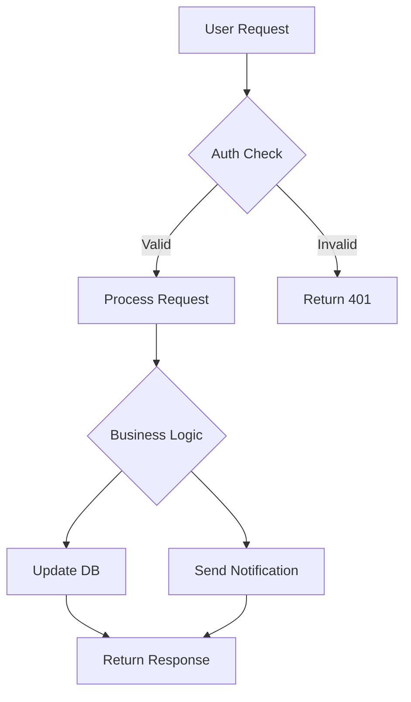

# cc-sdd 詳細分析

**分析日**: 2025-11-11  
**対象リポジトリ**: https://github.com/gotalab/cc-sdd

## 概要

cc-sdd は、**AI-DLC（AI-Driven Development Life Cycle）**を実装した、実践的なスペック駆動開発フレームワークです。Kiro IDE 互換のワークフローを 7 種類の AI エージェント × 12 言語に対応させ、**ステアリング（Steering）**という永続的プロジェクトメモリーを核としています。

---

## 1. 核心的なアーキテクチャ

### 1.1 三層ディレクトリ構造

```
.kiro/
├── steering/              # 【プロジェクトメモリー】永続的知識
│   ├── product.md         # プロダクト要件・ドメイン知識
│   ├── tech.md            # アーキテクチャ・技術スタック・規約
│   ├── structure.md       # ディレクトリ構造・命名規則
│   └── custom/            # カスタム知識ベース
│       └── *.md
├── specs/                 # 【機能仕様】個別機能の開発プロセス
│   └── [feature-name]/
│       ├── spec.json      # メタデータ
│       ├── requirements.md # 要件定義
│       ├── research.md    # 調査ログ（オプション）
│       ├── design.md      # 技術設計
│       └── tasks.md       # 実装タスク
└── settings/              # 【テンプレート】カスタマイズ可能
    ├── templates/
    │   ├── steering/
    │   │   ├── product.md
    │   │   ├── tech.md
    │   │   └── structure.md
    │   ├── requirements.md
    │   ├── design.md
    │   └── tasks.md
    └── rules/
        └── {{DEV_GUIDELINES}}
```

**重要な哲学**:

- **steering/** = プロジェクト全体の永続的記憶
- **specs/** = 機能単位の一時的ワークフロー
- **settings/** = チーム固有のプロセスカスタマイズ

### 1.2 AI-DLC ワークフロー

```
Phase 0 (optional): Steering
/kiro:steering → product.md, tech.md, structure.md
/kiro:steering-custom → custom/*.md

Phase 1: Specification
/kiro:spec-init → spec.json, requirements.md (stub)
       ↓
/kiro:spec-requirements → requirements.md (完成)
       ↓
/kiro:validate-gap (optional) → 既存コードとのギャップ分析
       ↓
/kiro:spec-design → research.md (必要時), design.md
       ↓
/kiro:validate-design (optional) → 設計レビュー
       ↓
/kiro:spec-tasks → tasks.md
       ↓
Phase 2: Implementation
/kiro:spec-impl → 実装
       ↓
/kiro:validate-impl (optional) → 実装検証
       ↓
/kiro:spec-status → 進捗確認（任意のタイミング）
```

**"Bolts, not Sprints"**:

- 従来のスプリント（週単位）ではなく、時間〜数日の集中サイクル
- 70%の管理オーバーヘッドを排除
- AI 主導で人間が検証

---

## 2. 革新的な Steering（プロジェクトメモリー）

### 2.1 Steering とは何か

**定義**: AI が全セッションで参照する、プロジェクト全体のコンテキスト

**3 つのデフォルトファイル**:

#### product.md

```markdown
# Product Vision

## Core Problem

## Target Users

## Key Features

## Success Metrics

## Domain Knowledge

## Business Rules

## Constraints
```

#### tech.md

```markdown
# Technical Foundation

## Architecture Pattern

## Technology Stack

## Code Conventions

## Testing Strategy

## Deployment Process

## Performance Requirements

## Security Guidelines
```

#### structure.md

```markdown
# Project Structure

## Directory Layout

## File Naming

## Module Organization

## Dependency Rules

## Import Conventions
```

**効果**:

- AI がプロジェクトの「記憶」を持つ
- 一貫した判断基準
- オンボーディング時間の短縮

### 2.2 Steering vs Specification

| 観点     | Steering                       | Specification      |
| -------- | ------------------------------ | ------------------ |
| スコープ | プロジェクト全体               | 個別機能           |
| 永続性   | 長期（数ヶ月〜年）             | 短期（数日〜週）   |
| 更新頻度 | 低頻度（アーキテクチャ変更時） | 高頻度（機能ごと） |
| 参照     | 全機能開発で参照               | 当該機能のみ       |
| 役割     | ルールブック                   | ワークログ         |

### 2.3 Custom Steering

```bash
/kiro:steering-custom [domain-specific-topic]
```

例:

- `payment-gateway-integration.md`
- `multi-tenant-data-isolation.md`
- `regulatory-compliance.md`

**活用シーン**:

- ドメイン固有の複雑なルール
- 法規制対応の記録
- チーム固有の暗黙知の明示化

---

## 3. 実践的な品質ゲート

### 3.1 validate-gap（既存コードとの乖離分析）

**目的**: 新機能が既存システムと統合可能かを事前確認

**実行タイミング**: requirements.md 完成後

**分析項目**:

- 既存アーキテクチャとの整合性
- 命名規則の一貫性
- 既存ライブラリとの重複
- データモデルの互換性

### 3.2 validate-design（設計レビュー）

**目的**: 設計が要件を満たし、実装可能かを確認

**実行タイミング**: design.md 完成後

**検証内容**:

- 全要件が設計に反映されているか
- 技術選択の妥当性
- パフォーマンス懸念の検討
- セキュリティリスクの考慮

### 3.3 validate-impl（実装検証）

**目的**: 実装がタスク完了条件を満たしているか

**実行タイミング**: 実装完了後

**確認事項**:

- 全タスクの完了
- テストの実装と合格
- ドキュメントの更新
- Steering との整合性

---

## 4. テンプレートカスタマイズの柔軟性

### 4.1 チーム固有プロセスへの適応

```
.kiro/settings/templates/
├── requirements.md     # 要件定義のフォーマット
├── design.md           # 設計書のフォーマット
└── tasks.md            # タスクリストのフォーマット
```

**v2.0.0 の設計テンプレート**:

```markdown
# Design: [Feature Name]

## Summary

| Item               | Content         |
| ------------------ | --------------- |
| Overview           | [1-2 sentences] |
| Key Components     | [bullet list]   |
| Integration Points | [list]          |

## System Flow

[Mermaid diagram]

## Components

### Component 1

- **Purpose**: [role]
- **Responsibilities**: [list]
- **Dependencies**: [list]

## Data Model

[Entity definitions]

## API Contracts

[Endpoint specifications]

## References

- requirements.md: [link to sections]
- steering/tech.md: [relevant principles]
```

**特徴**:

- **Fast-to-Review**: 要約テーブルでレビュー時間 5 倍短縮
- **Structured**: コンポーネント密度ルール
- **Traceable**: 要件への逆引き

### 4.2 DEV_GUIDELINES 変数

```markdown
## Development Guidelines

{{DEV_GUIDELINES}}
```

`{{DEV_GUIDELINES}}`は`.kiro/settings/rules/`から動的に展開：

- コーディング規約
- コミットメッセージルール
- PR テンプレート
- レビュー基準

---

## 5. マルチエージェント・マルチ言語対応

### 5.1 7 つの AI エージェント対応

1. **Claude Code** (`.claude/commands/kiro/`)
2. **Cursor** (`.cursor/commands/`)
3. **Codex** (`~/.codex/prompts/`) ※グローバル
4. **Gemini CLI** (`.gemini/tools/`)
5. **GitHub Copilot** (`.github/prompts/`)
6. **Qwen Code** (`.qwen/tools/`)
7. **Windsurf** (`.windsurf/workflows/`)

### 5.2 統一された 11 コマンド

全エージェントで同じワークフロー:

```bash
# Steering
/kiro:steering
/kiro:steering-custom

# Specification
/kiro:spec-init
/kiro:spec-requirements
/kiro:spec-design
/kiro:spec-tasks
/kiro:spec-status

# Quality Gates
/kiro:validate-gap
/kiro:validate-design
/kiro:validate-impl
```

### 5.3 12 言語対応テンプレート

- Python, JavaScript, TypeScript
- Java, C#, Go
- Rust, Ruby, PHP
- Swift, Kotlin, Shell

**言語固有の設定例**:

```javascript
function Get-LanguageConventions {
    param([string]$Lang)
    switch ($Lang) {
        'Python' { return "PEP 8, type hints, pytest" }
        'JavaScript|TypeScript' { return "ESLint, Prettier, Jest" }
        'Rust' { return "cargo fmt, clippy" }
        // ...
    }
}
```

---

## 6. 日本語・多言語サポート

### 6.1 完全な日本語ドキュメント

```
docs/README/
├── README_en.md      # 英語
├── README_ja.md      # 日本語
└── README_zh-TW.md   # 繁体中文

docs/guides/ja/
└── spec-driven.md    # 日本語ガイド
```

### 6.2 日本語コマンド例

```bash
/kiro:spec-init OAuth 2.0とJWTトークンを使用したユーザー認証をNext.jsアプリに実装

/kiro:spec-requirements user-auth-oauth
# → 日本語で質問、日本語で要件生成

/kiro:spec-design user-auth-oauth
# → 日本語の設計書
```

---

## 7. Kiro IDE 互換性

### 7.1 仕様の可搬性

```
.kiro/specs/[feature-name]/
```

この構造は Kiro IDE と完全互換：

- Kiro IDE で spec 開発 → cc-sdd で実装
- cc-sdd で spec 作成 → Kiro IDE でレビュー

### 7.2 Kiro 風ワークフロー

cc-sdd は[Kiro IDE](https://kiro.dev)の Spec-Driven Development を踏襲：

- 仕様ファースト
- AI との明確な協調ポイント
- ボルト単位の開発サイクル

---

## 8. 強みと限界

### 8.1 強み

✅ **プロジェクトメモリー**: Steering による永続的コンテキスト  
✅ **実践的ゲート**: validate-gap/design/impl で品質保証  
✅ **テンプレートカスタマイズ**: チームプロセスへの適応  
✅ **多言語対応**: 日本語含む 3 言語のドキュメント  
✅ **マルチエージェント**: 7 エージェント統一ワークフロー  
✅ **既存プロジェクト対応**: Brownfield 戦略が明確  
✅ **Fast-to-Review 設計**: v2.0.0 の構造化テンプレート

### 8.2 限界と課題

❌ **学習曲線**: Steering 概念の理解が必要  
❌ **セットアップ複雑性**: 7 エージェント × 設定ファイル  
❌ **Constitution 概念なし**: ガバナンス機能が不足  
❌ **変更追跡なし**: OpenSpec 的なデルタ管理なし  
❌ **CLI 機能が弱い**: CLI ツールが存在しない  
❌ **検証ロジック不明確**: validate-\*の実装詳細不足

---

## 9. 学ぶべきベストプラクティス

### 9.1 プロジェクトメモリー

1. **永続的知識の分離**: Steering vs Specification
2. **3 層コンテキスト**: Product + Tech + Structure
3. **カスタム知識ベース**: ドメイン固有の暗黙知を明示化

### 9.2 実践的品質管理

1. **段階的検証**: Gap → Design → Implementation
2. **既存コード統合**: validate-gap で事前確認
3. **レビュー負荷軽減**: Fast-to-Review テンプレート

### 9.3 チーム適応

1. **テンプレートカスタマイズ**: `.kiro/settings/templates/`
2. **DEV_GUIDELINES 変数**: チーム規約の動的展開
3. **言語固有設定**: 12 言語対応

---

## 10. 進化の歴史

### 10.1 v2.0.0 の革新（2025 年）

**主な変更**:

- ✅ Fast-to-Review Designs: 構造化設計書
- ✅ Separate Research: research.md の独立
- ✅ Quality Gates: validate-\*コマンド群
- ✅ Customize Once: テンプレート一元管理
- ✅ Universal Workflow: 7 エージェント統一

**v1.x からの移行**:

- レガシーフロー: `npx cc-sdd@1.1.5`で利用可能
- 段階的移行ガイドあり

### 10.2 Kiro IDE との関係

```
Kiro IDE (商用)
    ↓ ワークフロー継承
cc-sdd (OSS)
    ↓ 仕様互換
両方で協業可能
```

---

## 11. 独自の価値提案

cc-sdd の本質的価値は以下の 3 点：

### 11.1 プロジェクトメモリーの具現化

**問題**: AI がセッション間でコンテキストを失う  
**解決**: Steering による永続的記憶

### 11.2 実践的品質ゲート

**問題**: 机上の仕様が実装時に破綻  
**解決**: validate-gap/design/impl で段階的検証

### 11.3 チーム適応性

**問題**: 汎用フレームワークが組織に合わない  
**解決**: テンプレートとルールのカスタマイズ

---

## 12. ワークフロー比較

### 12.1 New Project (Greenfield)

```
spec-init → spec-requirements → spec-design → spec-tasks → spec-impl
```

### 12.2 Existing Project (Brownfield)

```
steering → spec-init → validate-gap → spec-design → validate-design → spec-tasks → spec-impl
```

**重要な違い**:

- Greenfield: Steering は後回しも可能
- Brownfield: Steering 必須（既存ルール理解のため）

---

## 13. 実装例（Design.md の System Flow）

v2.0.0 の設計書には、Mermaid 図が標準装備：



**効果**:

- ビジュアルで即座に理解
- レビューが速い
- 実装前の合意形成が容易

---

## 結論

cc-sdd は、**プロジェクトメモリー（Steering）**と**実践的品質ゲート**を核とした、現場志向の SDD フレームワークです。

**核心的価値**:

1. **Project Memory**: Steering による永続的 AI コンテキスト
2. **Practical Gates**: validate-\*による段階的品質保証
3. **Team Adaptability**: テンプレートカスタマイズ
4. **Multi-Everything**: 7 エージェント × 12 言語 × 3 言語ドキュメント

**私たちのプロジェクトへの示唆**:

- Steering 概念は採用すべき（GitHub Copilot Chat のセッション永続化）
- テンプレートカスタマイズの柔軟性を確保
- 日本語対応は必須
- validate-\*の具体的実装を明確化
- OpenSpec のデルタ管理と統合可能
