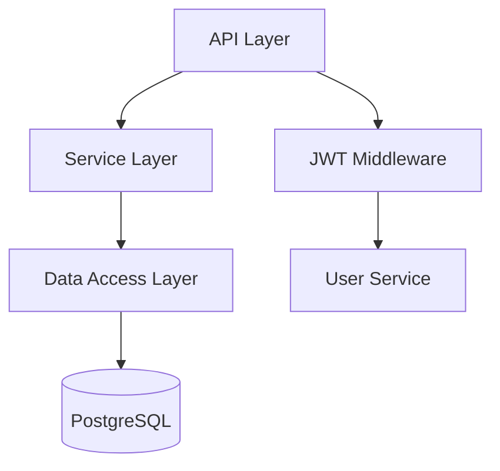

# claude-code-spec-workflow 詳細分析

**リポジトリ**: https://github.com/Pimzino/claude-code-spec-workflow  
**作成者**: Pimzino  
**分析日**: 2025-01-11

---

## 1. 概要

claude-code-spec-workflow は **Claude Code 専用** に最適化された SDD フレームワーク。TypeScript で実装され、NPX コマンド 1 つで完全セットアップが可能。

### 特徴的な独自機能

- **Steering Documents**: プロジェクト全体のコンテキスト永続化
- **Hierarchical Context Loading**: 一度に全コンテキストを読み込み
- **Auto-Generated Task Commands**: タスクごとに個別スラッシュコマンド生成
- **Bug Fix Workflow**: 小規模修正向けの軽量ワークフロー
- **Atomic Task Requirements**: 15-30 分で完了可能なタスク粒度

---

## 2. アーキテクチャ

### 2.1 ディレクトリ構造

```
.claude/                         # Claude Code 専用ディレクトリ
├── steering/                    # プロジェクトコンテキスト (独自)
│   ├── product.md              # プロダクトビジョン
│   ├── tech.md                 # 技術スタック・規約
│   └── structure.md            # ファイル構成・命名規則
├── specs/                       # 機能仕様
│   └── {feature-name}/
│       ├── requirements.md     # 要件定義
│       ├── design.md           # 設計
│       └── tasks.md            # タスク分解
├── bugs/                        # バグ修正ワークフロー (独自)
│   └── {bug-name}/
│       ├── report.md           # バグ報告
│       ├── analysis.md         # 根本原因分析
│       └── verification.md     # 検証計画
├── commands/                    # スラッシュコマンド
│   ├── spec-create.md          # フルワークフロー
│   ├── spec-execute.md         # タスク実行
│   ├── spec-steering-setup.md  # Steering セットアップ
│   ├── bug-create.md           # バグワークフロー
│   └── {feature-name}/         # 自動生成タスクコマンド
│       ├── task-1.md
│       ├── task-2.md
│       └── ...
├── templates/                   # ドキュメントテンプレート
│   ├── requirements-template.md
│   ├── design-template.md
│   ├── tasks-template.md
│   ├── product-template.md     # Steering 用
│   ├── tech-template.md        # Steering 用
│   └── structure-template.md   # Steering 用
└── agents/                      # AI エージェント (optional)
    ├── spec-requirements-validator.md
    ├── spec-design-validator.md
    └── spec-task-executor.md
```

### 2.2 Steering Documents (独自機能)

**目的**: プロジェクト全体の「舵取り情報」を永続化

**3 つのドキュメント**:

**product.md** (プロダクト文脈):

```markdown
# Product: Claude Code Spec Workflow

## Vision

Automate spec-driven development for Claude Code users

## Target Users

- Solo developers using Claude Code
- Small teams (2-5 people)
- Developers familiar with SDD concepts

## Key Features

- /spec-create: Full workflow automation
- Auto-generated task commands
- Steering documents for persistent context

## Business Objectives

- Reduce spec creation time by 70%
- Increase spec quality and consistency
- Enable one-command feature development

## Success Metrics

- Time to create spec: < 15 minutes
- Task completion rate: > 90%
- User satisfaction: 4.5+ / 5
```

**tech.md** (技術基準):

```markdown
# Technology: Claude Code Spec Workflow

## Tech Stack

- **Language**: TypeScript 5.0+
- **Runtime**: Node.js 16+
- **CLI**: Commander.js
- **Testing**: Vitest
- **Build**: tsup

## Technical Standards

- Follow ESLint Airbnb config
- Use Prettier for formatting
- Type-safe: No `any` types
- Test coverage: > 80%

## Architecture Patterns

- Command pattern for CLI
- Template Method for workflow steps
- Factory pattern for document generation

## Dependencies

- Avoid unnecessary dependencies
- Prefer native Node.js APIs
- Lock versions in package.json

## Security

- No secrets in code
- Validate all user inputs
- Sanitize file paths
```

**structure.md** (プロジェクト構造):

```markdown
# Project Structure: Claude Code Spec Workflow

## Directory Organization
```

src/
├── commands.ts # Slash command content
├── templates.ts # Template generators
├── setup.ts # Workflow setup logic
└── cli.ts # CLI entry point

.claude/
├── steering/ # Project context
├── specs/ # Feature specs
├── commands/ # Generated commands
└── templates/ # Document templates

```

## Naming Conventions
- **Files**: kebab-case (my-feature.ts)
- **Classes**: PascalCase (SpecWorkflowSetup)
- **Functions**: camelCase (generateTaskCommands)
- **Constants**: UPPER_SNAKE_CASE (MAX_TASK_COUNT)

## Code Organization
- One class per file
- Group related functions in modules
- Export public APIs from index.ts
- Keep files under 300 lines
```

**Steering のライフサイクル**:

```bash
# 初回セットアップ
/spec-steering-setup
→ コードベースを分析
→ ユーザーに推論結果を提示
→ 不足情報を質問
→ 3つのドキュメントを生成

# 以降の全コマンドで参照
/spec-create user-auth
→ steering/ を読み込み
→ product vision に沿った要件定義
→ tech standards に準拠した設計
→ structure conventions に従った実装計画
```

---

## 3. Workflow System

### 3.1 Spec Workflow (新機能開発)

**フルワークフロー**: `/spec-create <feature-name> [description]`

**フェーズシーケンス**:

```
Requirements → Design → Tasks → (Optional) Generate Task Commands
```

**Phase 1: Requirements**

**Template Usage** (重要):

```markdown
### Requirements Process

1. **Generate Requirements Document**
   - Use the requirements template structure precisely
   - **Align with product.md**: Ensure requirements support product vision
   - Create user stories: "As a [role], I want [feature], so that [benefit]"
   - Write acceptance criteria in EARS format (WHEN/IF/THEN statements)
   - **Reference steering documents**: Note how requirements align with vision
```

**EARS Format** (Easy Approach to Requirements Syntax):

```markdown
## Acceptance Criteria

### AC 1.1: User Registration

- WHEN a user submits the registration form
- IF all required fields are filled
- THEN the system creates a new user account
- AND sends a confirmation email
- AND redirects to the dashboard

### AC 1.2: Email Validation

- WHEN a user enters an email address
- IF the email format is invalid
- THEN the system displays an error message
- AND prevents form submission
```

**Validation (if available)**:

```markdown
### Requirements Validation and Approval

- **Automatic Validation (if agent available)**:
  Use the `spec-requirements-validator` agent to validate

The agent should:

1. Read requirements.md
2. Validate against all quality criteria
3. Check alignment with steering documents
4. Provide specific feedback
5. Rate overall quality: PASS, NEEDS_IMPROVEMENT, MAJOR_ISSUES

- **If validation agent not available**:
  Review manually against template criteria
- **Only present to user after validation passes**
```

**Phase 2: Design**

**Codebase Research (MANDATORY)**:

```markdown
### Design Process

1. **Load Previous Phase**: Ensure requirements.md exists and is approved
2. **Codebase Research** (MANDATORY):
   - **Map existing patterns**: Identify data models, API patterns, components
   - **Cross-reference with tech.md**: Ensure patterns align with standards
   - **Catalog reusable utilities**: Find validation functions, helpers, middleware
   - **Verify against structure.md**: Ensure file organization follows conventions
   - **Identify integration points**: Map how new feature connects to existing systems
```

**Code Reuse Analysis**:

```markdown
## Code Reuse Analysis (design.md に必須)

### Existing Components to Leverage

- **User Authentication**: Existing JWT service in `src/auth/jwt.py`
- **Database Layer**: Use existing SQLAlchemy models pattern
- **API Pattern**: Follow FastAPI dependency injection in `src/api/`
- **Validation**: Reuse Pydantic validators from `src/models/validators.py`

### Integration Points

- **User Model**: Extend existing User model in `src/models/user.py`
- **Database**: Add table to existing PostgreSQL schema
- **API Router**: Register new routes in `src/api/router.py`
```

**Mermaid Diagrams**:

````markdown
## Architecture (design.md より)


````

````

**Phase 3: Tasks**

**Atomic Task Requirements**:
```markdown
### Atomic Task Requirements:
- **Time Boxing**: Completable in 15-30 minutes by an experienced developer
- **Single Purpose**: One testable outcome per task
- **Specific Files**: Must specify exact files to create/modify
- **Agent-Friendly**: Clear input/output with minimal context switching

**Task Granularity Examples**:
- ❌ BAD: "Implement authentication system"
- ✅ GOOD: "Create User model in models/user.py with email/password fields"
- ❌ BAD: "Add user management features"
- ✅ GOOD: "Add password hashing utility in utils/auth.py using bcrypt"
````

**Task Format with Requirement Traceability**:

```markdown
## Tasks

### Setup Tasks

- [ ] Task 1: In src/models/user.py, create User model with id, email, username fields
      _Requirements: 1.1, 1.2_
      _Leverage: Existing SQLAlchemy base in src/models/base.py_

- [ ] Task 2: In src/auth/password.py, implement hash*password() using bcrypt cost 12
      \_Requirements: 2.1*
      _Leverage: None - new utility_

### API Tasks

- [ ] Task 3: In src/api/auth.py, create POST /register endpoint
      _Requirements: 1.1, 1.3_
      _Leverage: Existing API router pattern from src/api/user.py_
```

**Validation**:

```markdown
### Task Validation and Approval

- **Automatic Validation (if agent available)**:
  Use the `spec-tasks-validator` agent

The agent should:

1. Read tasks.md
2. Validate each task against atomic criteria
3. Check requirement traceability
4. Verify leverage references
5. Rate quality: PASS, NEEDS_IMPROVEMENT, MAJOR_ISSUES

- **If validation fails**:
  Break down broad tasks further before presenting
```

**Phase 4: Task Commands Generation (Optional)**

**自動生成機能**:

```bash
# ユーザーに確認
"Would you like me to generate individual task commands
for easier execution? (yes/no)"

# YES の場合
npx @pimzino/claude-code-spec-workflow@latest generate-task-commands user-auth

# 生成結果
.claude/commands/user-auth/
├── task-1.md   # /user-auth-task-1
├── task-2.md   # /user-auth-task-2
└── task-3.md   # /user-auth-task-3
```

**生成されるコマンド内容** (task-1.md):

```markdown
# Task Command: user-auth-task-1

Execute Task 1 from the user-auth specification.

## Task Details

- **ID**: Task 1
- **Description**: In src/models/user.py, create User model with id, email, username fields
- **Requirements**: 1.1, 1.2
- **Leverage**: Existing SQLAlchemy base in src/models/base.py

## Context to Load

- .claude/specs/user-auth/requirements.md
- .claude/specs/user-auth/design.md
- .claude/specs/user-auth/tasks.md
- .claude/steering/tech.md
- .claude/steering/structure.md

## Implementation Instructions

1. Read existing SQLAlchemy base pattern from src/models/base.py
2. Create User model class inheriting from Base
3. Add fields: id (primary key), email (unique), username (unique)
4. Add **repr** method for debugging
5. Ensure type hints are present

## Validation

- [ ] Model class created with correct inheritance
- [ ] All required fields present with correct types
- [ ] Unique constraints applied to email and username
- [ ] Type hints present for all fields
- [ ] **repr** method implemented

## Mark Complete

After implementation, mark Task 1 as [x] in tasks.md
```

### 3.2 Bug Fix Workflow (軽量版)

**コマンド**: `/bug-create <bug-name> [description]`

**フェーズシーケンス**:

```
Report → Analyze → Fix → Verify
```

**なぜ Bug Workflow が必要か？**:

```markdown
# Bug Create Command より

This is designed for smaller fixes that don't need
the full spec workflow overhead.

Use this when:

- Bug fix scope is clear
- No major architectural changes needed
- Can be completed in < 2 hours
- Isolated to 1-3 files
```

**Phase 1: Bug Report**

**Template**:

```markdown
# Bug Report: User Login Fails

## Observed Behavior

- User enters correct credentials
- Click "Login" button
- Error message: "Invalid credentials"
- User is not logged in

## Expected Behavior

- User enters correct credentials
- Click "Login" button
- User is successfully authenticated
- Redirected to dashboard

## Steps to Reproduce

1. Navigate to /login
2. Enter email: test@example.com
3. Enter password: Test123!
4. Click "Login"
5. Observe error

## Environment

- Browser: Chrome 120
- OS: macOS 14.2
- Server: Production (v1.2.3)

## Related Code

- src/api/auth.py: POST /login endpoint
- src/auth/service.py: authenticate() function
```

**Phase 2: Bug Analysis**

**Template**:

```markdown
# Bug Analysis: User Login Fails

## Root Cause

Password comparison logic in `src/auth/service.py`
is using `==` instead of bcrypt's `checkpw()`.

## Code Location

File: src/auth/service.py
Function: authenticate()
Line: 42

## Impact

- **Severity**: HIGH
- **Affected Users**: All users attempting to log in
- **Data Loss**: None
- **Security**: Password comparison is insecure

## Proposed Fix

1. Import bcrypt
2. Replace `password == stored_password`
   with `bcrypt.checkpw(password, stored_password)`
3. Add unit test for password verification

## Estimated Effort

- Fix: 15 minutes
- Testing: 10 minutes
- Total: 25 minutes
```

**Phase 3: Bug Fix**

**コマンド**: `/bug-fix`

**実行内容**:

```markdown
1. Load bug report and analysis
2. Load steering documents (tech.md, structure.md)
3. Implement the fix following the proposed solution
4. Ensure code follows project standards
5. Add/update tests as specified
6. Mark fix complete in analysis.md
```

**Phase 4: Bug Verification**

**Template**:

```markdown
# Bug Verification: User Login Fails

## Verification Steps

- [ ] Unit test passes: test_password_verification()
- [ ] Integration test passes: test_login_endpoint()
- [ ] Manual testing:
  - [ ] Can log in with correct credentials
  - [ ] Cannot log in with incorrect password
  - [ ] Error message is appropriate

## Verification Results

✅ All tests passing
✅ Manual testing confirms fix
✅ No regressions detected

## Deployment

- Deployed to staging: 2025-01-11 14:30
- Verified in staging: 2025-01-11 14:45
- Ready for production: YES
```

---

## 4. Hierarchical Context Loading (独自機能)

### 4.1 原則: "一度に全コンテキストを読み込む"

**従来の問題**:

```markdown
❌ 従来:

1. requirements.md を読み込む
2. → ユーザーに質問
3. design.md を読み込む
4. → ユーザーに質問
5. tasks.md を読み込む
   → 非効率、ユーザーは何度も中断される
```

**Hierarchical Context Loading**:

```markdown
✅ 新方式:

1. **一度に全コンテキストを読み込む**:
   - steering/ (product.md, tech.md, structure.md)
   - templates/ (requirements-template.md, design-template.md, tasks-template.md)
2. → 内部処理で全フェーズを実行
3. → 各フェーズ完了時のみユーザーに確認
   → ユーザーの中断が最小化
```

### 4.2 実装例 (spec-create コマンド)

**Step 1: Load ALL Context Once**:

````markdown
## Instructions

### Initial Setup

1. Create Directory Structure
2. **Load ALL Context Once (Hierarchical Context Loading)**

Load complete context at the beginning:

```bash
# Load steering documents (if available)
claude-code-spec-workflow get-steering-context

# Load specification templates
claude-code-spec-workflow get-template-context spec
```
````

**Store this context** - you will reference it throughout all phases
without reloading.

````

**Step 2: Use Pre-Loaded Context**:
```markdown
## PHASE 1: Requirements Creation

**Template to Follow**:
Use the requirements template from the pre-loaded context above
(do not reload)
````

**Step 3: Never Reload**:

```markdown
### Template Usage

- **Use the pre-loaded template context** from step 2 above
  - do not reload templates.
- **Requirements**: Must follow requirements template structure exactly
- **Reference the loaded templates**
  - all specification templates were loaded at the beginning
```

### 4.3 Context Optimization Commands

**一括コンテキスト取得コマンド**:

```bash
# Steering documents を一括取得
claude-code-spec-workflow get-steering-context

# Output:
# # Steering Documents
#
# ## Product Vision
# [product.md の内容]
#
# ## Technical Standards
# [tech.md の内容]
#
# ## Project Structure
# [structure.md の内容]

# Spec documents を一括取得
claude-code-spec-workflow get-spec-context user-auth

# Output:
# # Specification: user-auth
#
# ## Requirements
# [requirements.md の内容]
#
# ## Design
# [design.md の内容]
#
# ## Tasks
# [tasks.md の内容]

# Templates を一括取得
claude-code-spec-workflow get-template-context spec

# Output:
# # Specification Templates
#
# ## Requirements Template
# [requirements-template.md の内容]
#
# ## Design Template
# [design-template.md の内容]
#
# ## Tasks Template
# [tasks-template.md の内容]
```

**利点**:

- ✅ AI エージェントの Tool Call 回数削減
- ✅ ユーザーの待ち時間短縮
- ✅ コンテキスト一貫性の保証

---

## 5. Atomic Task Requirements (独自機能)

### 5.1 厳格なタスク粒度

**Time Boxing**:

```markdown
- **Time Boxing**: Completable in 15-30 minutes by an experienced developer
```

**Single Purpose**:

```markdown
- **Single Purpose**: One testable outcome per task
```

**Specific Files**:

```markdown
- **Specific Files**: Must specify exact files to create/modify
```

**Agent-Friendly**:

```markdown
- **Agent-Friendly**: Clear input/output with minimal context switching
```

### 5.2 Good vs Bad Examples

**Bad Task** (曖昧、大きすぎる):

```markdown
❌ BAD:

- [ ] Implement authentication system
      → 問題点:
  - 範囲が広すぎる (複数ファイル、複数機能)
  - 時間がかかりすぎる (>2 時間)
  - テスト可能性が不明確
```

**Good Task** (具体的、小さい):

```markdown
✅ GOOD:

- [ ] Create User model in models/user.py with email/password fields
      → 良い点:
  - 単一ファイル
  - 15-30 分で完了
  - テスト可能 (モデルのインスタンス化を検証)
```

**Bad Task** (漠然としている):

```markdown
❌ BAD:

- [ ] Add user management features
      → 問題点:
  - "user management" が何を指すか不明
  - 複数機能の可能性 (CRUD、権限、プロフィール...)
```

**Good Task** (明確):

```markdown
✅ GOOD:

- [ ] Add password hashing utility in utils/auth.py using bcrypt
      → 良い点:
  - 単一の utility function
  - ライブラリ指定 (bcrypt)
  - ファイルパス明記
```

### 5.3 Self-Validation Before Presentation

**Agent が自己チェック**:

```markdown
### Task Validation and Approval

- **If validation agent not available**:
  Self-validate each task against atomic criteria first:
  - Does each task specify exact files to modify/create?
  - Can each task be completed in 15-30 minutes?
  - Does each task have a single, testable outcome?
  - Are any tasks still too broad (>100 characters description)?
- **If validation fails**:
  Break down broad tasks further before presenting
```

**Example**:

```markdown
# Agent の内部チェック

Task: "Implement authentication system"
✅ Exact files? → ❌ NO (曖昧)
✅ 15-30 min? → ❌ NO (大きすぎる)
✅ Single outcome? → ❌ NO (複数機能)

→ Agent が自動的に分解:

- [ ] Task 1: In src/models/user.py, create User model...
- [ ] Task 2: In src/auth/password.py, implement hash_password()...
- [ ] Task 3: In src/api/auth.py, create POST /register endpoint...

→ ユーザーには分解後のタスクのみ提示
```

---

## 6. Approval Requirements (承認プロセス)

### 6.1 厳格な承認フロー

**NEVER proceed without approval**:

```markdown
### Approval Requirements

- **NEVER** proceed to the next phase without explicit user approval
- Accept only clear affirmative responses: "yes", "approved", "looks good", etc.
- If user provides feedback, make revisions and ask for approval again
- Continue revision cycle until explicit approval is received
```

**Do NOT skip phases**:

```markdown
### Universal Rules

- **Do not proceed without explicit user approval** between phases
- **Do not skip phases** - complete Requirements → Design → Tasks sequence
```

### 6.2 Approval Markers

**✅ APPROVED マーカー**:

```markdown
### Requirements Validation and Approval

- **WHEN APPROVED**:
  Add "✅ APPROVED" at the top of requirements.md after the main heading

### Design Validation and Approval

- **WHEN APPROVED**:
  Add "✅ APPROVED" at the top of design.md after the main heading

### Task Validation and Approval

- **WHEN APPROVED**:
  Add "✅ APPROVED" at the top of tasks.md after the main heading
```

**Example**:

```markdown
# Requirements: User Authentication

✅ APPROVED

## Overview

...
```

---

## 7. NPX Command の活用

### 7.1 Zero-Configuration Setup

**一発セットアップ**:

```bash
npx @pimzino/claude-code-spec-workflow@latest setup
```

**実行内容**:

```typescript
// src/setup.ts より

export class SpecWorkflowSetup {
  async setupWorkflow(): Promise<void> {
    // 1. ディレクトリ作成
    await this.setupDirectories();
    // .claude/steering/, specs/, commands/, templates/, bugs/, agents/

    // 2. スラッシュコマンド作成
    await this.createSlashCommands();
    // spec-create, spec-execute, spec-steering-setup, bug-create など

    // 3. テンプレート作成
    await this.createTemplates();
    // requirements-template.md, design-template.md など

    // 4. エージェント作成 (optional)
    await this.setupAgents();
    // spec-requirements-validator など

    // 5. 完了メッセージ
    console.log("✅ Setup complete! Use /spec-create to get started.");
  }
}
```

**利点**:

- ✅ 設定ファイル不要 (Zero-Configuration)
- ✅ 最新版を自動取得 (`@latest`)
- ✅ Node.js 16+ があれば即座に使える

### 7.2 Task Command Generation

**コマンド**:

```bash
npx @pimzino/claude-code-spec-workflow@latest generate-task-commands user-auth
```

**実行内容**:

```typescript
// tasks.md を解析
const tasks = parseTasksMarkdown(".claude/specs/user-auth/tasks.md");

// 各タスクに対してコマンド生成
for (const task of tasks) {
  const commandPath = `.claude/commands/user-auth/task-${task.id}.md`;
  const content = generateTaskCommand(task, spec);
  await fs.writeFile(commandPath, content);
}

console.log(`✅ Generated ${tasks.length} task commands`);
console.log("Please restart Claude Code for new commands to be visible");
```

**生成されるコマンド数**:

```
tasks.md に 15 タスク
→ 15 個のスラッシュコマンド生成
→ /user-auth-task-1 ~ /user-auth-task-15
```

---

## 8. 独自性の評価

### 8.1 他フレームワークとの差分

| 要素                         | spec-kit  | shotgun   | claude-code-spec-workflow   |
| ---------------------------- | --------- | --------- | --------------------------- |
| Steering Documents           | ❌        | ❌        | ✅ (product/tech/structure) |
| Hierarchical Context Loading | ❌        | ⚠️ 部分的 | ✅ (一括読み込み)           |
| Auto-Generated Task Commands | ❌        | ❌        | ✅ (NPX コマンド)           |
| Bug Fix Workflow             | ❌        | ❌        | ✅ (軽量版ワークフロー)     |
| Atomic Task Requirements     | ⚠️ 基本的 | ⚠️ 基本的 | ✅ (15-30 min 厳守)         |
| NPX Setup                    | ❌        | ❌        | ✅ (Zero-Config)            |
| Approval Markers             | ❌        | ❌        | ✅ (✅ APPROVED)            |
| EARS Format                  | ❌        | ❌        | ✅ (Acceptance Criteria)    |

### 8.2 Claude Code への完全最適化

**特化した機能**:

1. **Claude Code のスラッシュコマンド形式**:

```markdown
# Spec Create Command

Create a new feature specification...

## Usage
```

/spec-create <feature-name> [description]

```

```

2. **Claude Code の Agent System 活用**:

```markdown
**Agent-Based Execution (Recommended)**:
If the `spec-task-executor` agent is available, use it...
```

3. **.claude/ ディレクトリ**:

```
Claude Code が自動認識するディレクトリ名を使用
```

4. **Markdown ベースのコマンド**:

```
Claude Code はマークダウンファイルをコマンドとして認識
```

---

## 9. 統合可能性

### 9.1 私たちのフレームワークへの統合アイデア

**採用すべき要素**:

1. **Steering Documents のコンセプト**:

   - 用途: `/memory/constitution.md` の拡張
   - 実装: `product.md` (ビジョン), `tech.md` (技術基準), `structure.md` (構造規約) を追加

2. **Hierarchical Context Loading**:

   - 用途: コマンド実行時の一括コンテキスト読み込み
   - 実装: GitHub Copilot Chat の Agent Context に一度に全ドキュメントを渡す

3. **Atomic Task Requirements** (15-30 min):

   - 用途: タスクの適切な粒度保証
   - 実装: `/ikak:tasks` コマンドで自動チェック

4. **✅ APPROVED マーカー**:

   - 用途: 承認状態の明示化
   - 実装: 各ドキュメントの先頭に追加

5. **Bug Fix Workflow**:
   - 用途: 小規模修正の高速化
   - 実装: `/ikak:bug` コマンドを追加 (Report → Analyze → Fix → Verify)

### 9.2 避けるべき要素

❌ **NPX コマンドへの完全依存**:

- 理由: GitHub Copilot Chat では外部コマンド実行が制限される
- 代替: Bash スクリプトで同等機能を実装

❌ **Auto-Generated Task Commands**:

- 理由: GitHub Copilot Chat はスラッシュコマンドの動的追加が困難
- 代替: tasks.md 内でタスク ID を指定する方式

❌ **TypeScript CLI の完全移植**:

- 理由: VS Code 統合では Bash の方が軽量
- 代替: 必要な機能のみ Bash で実装

---

## 10. 弱点とリスク

### 10.1 Claude Code 専用

**問題**:

- 他の AI ツール (Cursor, Windsurf) では使えない
- Claude Code のバージョンアップで動作しなくなるリスク

**対策**:

- README に明記: "This is Claude Code specific"
- 汎用化は検討外 (専用最適化が強み)

### 10.2 TypeScript/Node.js 依存

**問題**:

- Node.js 環境がない場合はセットアップ不可
- TypeScript のビルドステップが必要

**対策**:

- NPX で最新版を自動取得
- ビルド済みの npm パッケージを配布

### 10.3 Steering Documents の初回作成コスト

**問題**:

- `/spec-steering-setup` で product/tech/structure を手動入力
- 既存プロジェクトの場合、コードベース分析が必要

**対策**:

- AI がコードベースを分析して推論
- ユーザーに確認して修正

---

## 11. まとめ

### 強み

1. ✅ **Steering Documents**: プロジェクトコンテキストの永続化
2. ✅ **Hierarchical Context Loading**: 一括読み込みで効率化
3. ✅ **Auto-Generated Task Commands**: タスクごとにスラッシュコマンド
4. ✅ **Bug Fix Workflow**: 軽量版ワークフロー
5. ✅ **Atomic Task Requirements**: 15-30 分の厳格な粒度
6. ✅ **NPX Zero-Config Setup**: 設定ファイル不要
7. ✅ **Approval Markers**: 承認状態の可視化
8. ✅ **EARS Format**: 明確な Acceptance Criteria

### 弱み

1. ❌ Claude Code 専用 (他ツール非対応)
2. ❌ TypeScript/Node.js 依存
3. ❌ Steering Documents の初回作成コスト

### 私たちのフレームワークへの示唆

**採用**:

- Steering Documents (product/tech/structure)
- Hierarchical Context Loading
- Atomic Task Requirements (15-30 min)
- ✅ APPROVED マーカー
- Bug Fix Workflow
- EARS Format (Acceptance Criteria)

**回避**:

- NPX コマンドへの完全依存
- Auto-Generated Task Commands (GitHub Copilot Chat では困難)
- TypeScript CLI の完全移植

---

**次のステップ**: 全 6 フレームワーク (spec-kit, OpenSpec, cc-sdd, spec-kitty, shotgun, claude-code-spec-workflow) の総合比較表を作成し、私たちのフレームワークへの統合戦略を更新する。
