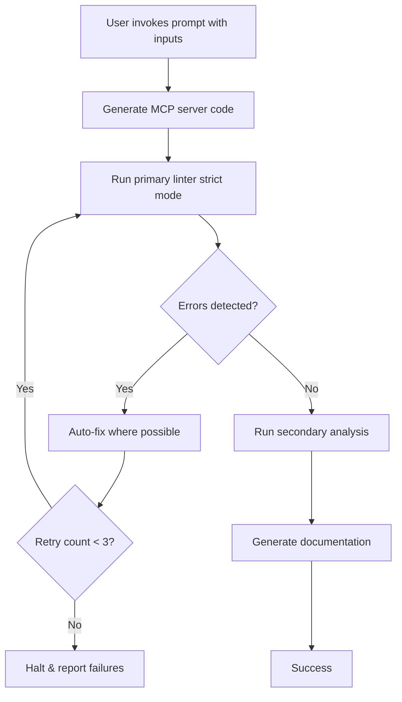

# Lint Strategy Matrix & Language-Specific Enforcement

> **Attribution**: Comprehensive lint enforcement strategy for 9 languages  
> **Version**: 2.0.0  
> **Last Updated**: 2025-01-13

## Overview

このドキュメントは、TypeScript, Go, Rust, Java, Kotlin, Swift, C#, Ruby, PHP の 9 言語にわたる超厳格 lint ルール戦略と、言語別の検証強化パターンを提供します。

---

## 1. Lint Strategy Matrix

### 1.1 言語 × ツール × 重大度マップ

| 言語           | Primary Tool  | Secondary Tool      | Complexity Limit         | Severity                | Config Location                  |
| -------------- | ------------- | ------------------- | ------------------------ | ----------------------- | -------------------------------- |
| **TypeScript** | ESLint        | Biome               | -                        | Error (no warnings)     | `lint/typescript/.eslintrc.json` |
| **Go**         | golangci-lint | gofmt/goimports     | cyclomatic: 10           | Error (revive)          | `lint/go/.golangci.yml`          |
| **Rust**       | clippy        | rustfmt             | -                        | Deny (pedantic/nursery) | `lint/rust/clippy.toml`          |
| **Java**       | Checkstyle    | SpotBugs + Spotless | -                        | Error                   | `lint/java/checkstyle.xml`       |
| **Kotlin**     | ktlint        | detekt              | cognitive: 25, nested: 4 | Error                   | `lint/kotlin/.editorconfig`      |
| **Swift**      | SwiftLint     | swift-format        | line: 120                | Error (force_try)       | `lint/swift/.swiftlint.yml`      |
| **C#**         | Roslyn        | StyleCop + FxCop    | -                        | Error (all CA/IDE)      | `lint/csharp/.editorconfig`      |
| **Ruby**       | RuboCop       | SimpleCov           | method: 15, ABC: 20      | Error                   | `lint/ruby/.rubocop.yml`         |
| **PHP**        | PHPCS         | PHPStan             | line: 120                | Error (warnings=errors) | `lint/php/phpcs.xml.dist`        |

### 1.2 共通エスカレーションポリシー

```yaml
Global Policy:
  warnings_as_errors: true
  fail_on_first_error: false # Collect all errors for batch fixing
  max_retries: 3
  auto_fix: true # Where possible (gofmt, eslint --fix, etc.)
```

---

## 2. Language-Specific Enforcement Details

### 2.1 TypeScript (ESLint + Biome)

#### Ultra-Strict Rules:

```json
{
  "@typescript-eslint/no-explicit-any": "error",
  "@typescript-eslint/no-unsafe-assignment": "error",
  "@typescript-eslint/no-unsafe-call": "error",
  "@typescript-eslint/no-unsafe-member-access": "error",
  "@typescript-eslint/no-unsafe-return": "error",
  "@typescript-eslint/no-floating-promises": "error",
  "no-warning-comments": [
    "error",
    { "terms": ["TODO", "FIXME"], "location": "start" }
  ],
  "import/no-default-export": "error"
}
```

#### Commands (from Validation section):

```bash
npm run build          # TypeScript compilation check
npm run test           # Unit tests with coverage
npm run lint           # ESLint strict mode
npm run format:check   # Prettier/Biome format verification
npm run type-check     # tsc --noEmit strict null checks
```

#### Edge Cases:

- Empty input validation (0-length strings, null arrays)
- Invalid tool name detection
- Large input handling (>10MB payloads)
- Concurrent request race conditions

#### Failure Modes:

- `@typescript-eslint/no-explicit-any` violation → Force explicit typing
- `no-floating-promises` → Async operations must be awaited or caught
- Missing error handling → All try-catch blocks required for I/O
- Format violations → Auto-fix with `npm run format`

---

### 2.2 Go (golangci-lint)

#### Ultra-Strict Rules:

```yaml
linters:
  enable:
    - gosec # Security checks
    - goconst # Repeated strings detection
    - gocyclo # Cyclomatic complexity (max 10)
    - misspell # Spelling errors
    - revive # Drop-in replacement for golint
    - errcheck # Unchecked errors
    - wrapcheck # Error wrapping enforcement

linters-settings:
  gocyclo:
    min-complexity: 10
  revive:
    severity: error
```

#### Commands:

```bash
go build ./...                  # Compilation check
go test -v -race -cover ./...   # Tests with race detector
go vet ./...                    # Static analysis
golangci-lint run --max-issues-per-linter 0 --max-same-issues 0
gofmt -d .                      # Format check (must output nothing)
goimports -d .                  # Import organization check
```

#### Edge Cases:

- Nil pointer dereference (defensive nil checks required)
- Context cancellation handling (always defer cancel())
- Empty struct initialization (`&MyStruct{}` vs `new(MyStruct)`)
- Race conditions in goroutines

#### Failure Modes:

- `wrapcheck` → Errors must be wrapped with context: `fmt.Errorf("context: %w", err)`
- Unused variable → Remove or prefix with `_`
- Cyclomatic complexity >10 → Extract functions
- Missing error check → All errors must be handled or explicitly ignored: `_ = err`

---

### 2.3 Rust (clippy + rustfmt)

#### Ultra-Strict Rules:

```toml
# clippy.toml
pedantic = "deny"
nursery = "deny"
unwrap_used = "deny"
expect_used = "deny"
todo = "deny"
wildcard_imports = "deny"

# rustfmt.toml
max_width = 100
hard_tabs = false
edition = "2021"
```

#### Commands:

```bash
cargo build --release          # Optimized build check
cargo test --all-features      # All feature combinations
cargo clippy --all-targets --all-features -- -D warnings
cargo fmt -- --check           # Format verification
cargo doc --no-deps            # Documentation generation
```

#### Edge Cases:

- `unwrap()` / `expect()` forbidden → Use `?` operator or explicit match
- Wildcard imports (`use module::*`) forbidden → Explicit imports only
- `todo!()` / `unimplemented!()` → Must be replaced with actual code
- Panic handling → Prefer `Result<T, E>` over panicking

#### Failure Modes:

- `clippy::unwrap_used` → Replace with `?` or `match`
- Unused `Result<T, E>` → Must be handled with `?` or `let _ = ...`
- Dead code → Remove or add `#[allow(dead_code)]` with justification
- Non-exhaustive match → Add all enum variants or `_ => ...` with comment

---

### 2.4 Java (Checkstyle + SpotBugs + Spotless)

#### Ultra-Strict Rules:

```xml
<!-- checkstyle.xml -->
<module name="Checker">
  <module name="TreeWalker">
    <module name="JavadocMethod"/>    <!-- All public methods require Javadoc -->
    <module name="UnusedImports"/>
    <module name="AvoidStarImport"/>  <!-- No wildcard imports -->
    <module name="NeedBraces"/>       <!-- Braces required for all blocks -->
  </module>
</module>
```

#### Commands:

```bash
./gradlew build                    # Compilation + tests
./gradlew test                     # Unit tests
./gradlew checkstyleMain checkstyleTest
./gradlew spotbugsMain             # Static bug detection
./gradlew spotlessCheck            # Code formatting
./gradlew jacocoTestReport         # Code coverage report
```

#### Edge Cases:

- `Optional.empty()` handling → Never call `.get()` without `.isPresent()`
- Stream empty cases → `.findFirst().orElse(default)`
- Null from external APIs → Annotate with `@Nullable` and check
- Parallel streams → Thread-safety for shared state

#### Failure Modes:

- Missing Javadoc → Add `/** @param x description @return description */`
- Unused import → Remove with IDE auto-fix
- Star import (`import java.util.*`) → Expand to explicit imports
- NPE risk → Use `Objects.requireNonNull()` or Optional

---

### 2.5 Kotlin (ktlint + detekt)

#### Ultra-Strict Rules:

```yaml
# detekt.yml
complexity:
  CognitiveComplexMethod:
    threshold: 25
  NestedBlockDepth:
    threshold: 4
  TooManyFunctions:
    thresholdInFiles: 15
```

#### Commands:

```bash
./gradlew build                    # Compilation + tests
./gradlew test                     # Unit tests
./gradlew ktlintCheck              # Kotlin style check
./gradlew detekt                   # Static analysis
./gradlew koverReport              # Code coverage
```

#### Edge Cases:

- `!!` operator (force unwrap) → Forbidden, use `?.let {}` or safe calls
- Long methods (>25 lines) → Extract smaller functions
- Nested blocks (>4 levels) → Flatten with early returns
- Magic numbers → Extract to named constants
- Sealed class exhaustiveness → Always handle all branches

#### Failure Modes:

- Force unwrap `!!` → NPE risk, replace with `?:` Elvis or `.let {}`
- Cognitive complexity >25 → Simplify logic or extract methods
- Too many functions (>15) → Split into multiple files/classes
- Missing kdoc → Add `/** Description */` for public APIs

---

### 2.6 Swift (SwiftLint + swift-format)

#### Ultra-Strict Rules:

```yaml
# .swiftlint.yml
opt_in_rules:
  - force_try # try! forbidden → error
  - unused_import # Remove unused imports
  - unused_declaration # Remove unused code

line_length:
  warning: 120
  error: 121
type_name:
  max_length:
    warning: 40
    error: 41
```

#### Commands:

```bash
swift build                        # Compilation check
swift test                         # Unit tests
swiftlint lint --strict            # Zero warnings mode
swift-format lint -r .             # Format verification
swift-format format -i -r .        # Auto-format
```

#### Edge Cases:

- `try!` (force try) → Forbidden, use `try?` or `do-catch`
- Unused declarations → Remove or document why kept
- Unused imports → Clean up with Xcode organize imports
- Optional chaining depth (>3 levels) → Flatten with `guard let`
- Async not awaited → All `async` calls must be `await`ed

#### Failure Modes:

- Force unwrap `!` → Runtime crash if nil, replace with optional binding
- Force try `try!` → Runtime error if throws, use `try?` or `do-catch`
- Long line (>120) → Break into multiple lines
- Type name length (>40) → Shorten or extract nested types

---

### 2.7 C# (Roslyn Analyzers + StyleCop + FxCop)

#### Ultra-Strict Rules:

```ini
# .editorconfig
[*.cs]
dotnet_diagnostic.CA1062.severity = error  # Validate arguments
dotnet_diagnostic.CA1305.severity = error  # IFormatProvider required
dotnet_diagnostic.CA1822.severity = error  # Mark members as static
dotnet_diagnostic.IDE0051.severity = error # Remove unused private members
```

#### Commands:

```bash
dotnet build /warnaserror          # Treat warnings as errors
dotnet test                        # Unit tests
dotnet format --verify-no-changes  # Format verification
dotnet build /p:TreatWarningsAsErrors=true
dotnet test --collect:"XPlat Code Coverage"
reportgenerator -reports:**/coverage.cobertura.xml -targetdir:coverage
```

#### Edge Cases:

- Nullable reference types (`string?` vs `string`) → Enable nullable context
- `async void` → Forbidden except event handlers, use `async Task`
- LINQ deferred execution → Force with `.ToList()` when needed
- Culture-dependent string formatting → Always specify `CultureInfo`

#### Failure Modes:

- Missing accessibility modifier → Add `public`/`private`/`internal` explicitly
- Unused private member (IDE0051) → Remove or document why kept
- CA1062 null check → Add `ArgumentNullException.ThrowIfNull(param);`
- CA1822 static suggestion → Make static or document instance state usage

---

### 2.8 Ruby (RuboCop + SimpleCov)

#### Ultra-Strict Rules:

```yaml
# .rubocop.yml
Metrics/MethodLength:
  Max: 15
Metrics/AbcSize:
  Max: 20
Style/Documentation:
  Enabled: true # All classes/modules require doc comments
Lint/Debugger:
  Enabled: true # No debugger/binding.pry in committed code
```

#### Commands:

```bash
bundle install                     # Dependency installation
bundle exec rspec                  # Test suite
bundle exec rubocop                # Style + lint checks
bundle exec rubocop -a             # Auto-fix safe violations
bundle exec simplecov              # Code coverage report
```

#### Edge Cases:

- `frozen_string_literal: true` missing → Add magic comment to all files
- Method length >15 lines → Extract smaller methods
- ABC complexity >20 → Simplify assignments/branches/calls
- Missing class documentation → Add `# Description` before class
- `debugger` / `binding.pry` statements → Remove before commit

#### Failure Modes:

- `Metrics/MethodLength` → Split method into smaller units
- `Metrics/AbcSize` → Reduce assignments, branches, conditional calls
- `Style/Documentation` → Add `# This class does X` before class definition
- `Naming/VariableNumber` → Rename `var1`, `var2` to descriptive names

---

### 2.9 PHP (PHPCS + PHPStan)

#### Ultra-Strict Rules:

```xml
<!-- phpcs.xml.dist -->
<rule ref="PSR12"/>
<config name="show_warnings" value="1"/>
<config name="ignore_warnings_on_exit" value="0"/>  <!-- Warnings = errors -->
```

```neon
# phpstan.neon
parameters:
    level: max
    treatPhpDocTypesAsCertain: false
    checkExplicitMixed: true
    checkMissingCallableSignature: true
```

#### Commands:

```bash
composer install                   # Dependency installation
vendor/bin/phpunit                 # Test suite
vendor/bin/phpcs --report=full --report-width=120
vendor/bin/phpcbf                  # Auto-fix coding standards
vendor/bin/phpstan analyse --level=max src/
```

#### Edge Cases:

- Missing `declare(strict_types=1);` → Required at top of all files
- Undefined array key access → Use `isset()` or `array_key_exists()`
- Mixed type → Explicit type hints required, no `mixed` unless documented
- Nullable parameter (`?string`) → Document in PHPDoc
- Always-true conditions → Dead code detection with PHPStan

#### Failure Modes:

- Missing `strict_types` → PHPStan level 6+ detection
- Line length >120 → Break long lines
- Explicit mixed type → Document why mixed is necessary with PHPDoc
- Missing callable signature → Add `@param callable(int): string` format

---

## 3. Validation Enhancement Patterns (Integrated from All 9 Languages)

### 3.1 Required Checks (Universal)

```markdown
## Validation

### Required Checks:

1. **Compilation/Build**: Code must compile without errors
2. **Type Safety**: All type checks pass (TS, Rust, Swift strict mode)
3. **Style Enforcement**: Linter passes with zero warnings
4. **Format Compliance**: Code formatter reports no changes needed
5. **Test Coverage**: Minimum 80% line coverage (configurable)
6. **Security Scan**: No high/critical vulnerabilities (gosec, SpotBugs, etc.)
```

### 3.2 Commands Pattern (5-6 per language)

All languages implement this structure:

```markdown
### Commands:

1. Build/Compile check
2. Test suite execution with coverage
3. Primary linter (strict mode)
4. Secondary static analysis
5. Format verification
6. (Optional) Documentation generation
```

**Example (TypeScript)**:

```bash
npm run build && npm run test && npm run lint && npm run format:check && npm run type-check
```

**Example (Rust)**:

```bash
cargo build --release && cargo test --all-features && cargo clippy -- -D warnings && cargo fmt -- --check && cargo doc
```

### 3.3 Edge Cases Pattern (4-5 per language)

Pattern categories:

1. **Null/Empty/Zero cases**: nil pointers, empty arrays, 0-length strings
2. **Concurrency issues**: race conditions, deadlocks, async not awaited
3. **Type system edge cases**: force unwrap, unsafe casts, wildcard imports
4. **API boundary issues**: external null returns, invalid input, large payloads

**Example (Go)**:

```markdown
### Edge Cases:

- Nil pointer dereference → Always check `if x != nil` before access
- Context cancellation → Always `defer cancel()` after `context.WithCancel()`
- Empty struct initialization → Prefer `&MyStruct{}` for zero values
- Race conditions → Use `go test -race` to detect
```

### 3.4 Failure Modes Pattern (4-5 per language)

Pattern categories:

1. **Type safety violations**: `any`, `!`, `!!`, unsafe casts
2. **Missing error handling**: unwrapped errors, unchecked returns
3. **Complexity violations**: cyclomatic >10, method length >15, ABC >20
4. **Code quality issues**: unused code, missing documentation, star imports

**Example (Kotlin)**:

```markdown
### Failure Modes:

- Force unwrap `!!` → NPE risk at runtime, use `?.let {}` or Elvis `?:`
- Cognitive complexity >25 → Detected by detekt, extract smaller functions
- Too many functions (>15 per file) → Split into multiple files
- Missing kdoc → Public APIs require `/** ... */` documentation
```

---

## 4. Auto-Installer Script Integration

### 4.1 スクリプト機能

`scripts/install-lint-config.sh` provides:

- Language selection (1-9 choice menu)
- GitHub mode: Clone awesome-copilot-inspired configs
- Local mode: Use existing `lint/` directory configs
- Backup existing files before overwriting
- Post-install instructions with validation commands

### 4.2 使用例

```bash
# Interactive mode
./scripts/install-lint-config.sh

# Direct language selection
./scripts/install-lint-config.sh typescript

# Local mode with custom path
./scripts/install-lint-config.sh go --repo-path /path/to/my/go/project
```

---

## 5. Metrics & Quality Gates

### 5.1 定義された品質ゲート

| Gate                     | Threshold                                    | Enforcement                              |
| ------------------------ | -------------------------------------------- | ---------------------------------------- |
| Lint Errors              | 0                                            | CI must pass                             |
| Lint Warnings            | 0                                            | Escalated to errors                      |
| Test Coverage            | ≥80%                                         | Reported but not blocking (configurable) |
| Cyclomatic Complexity    | Language-specific (10 for Go, 25 for Kotlin) | Enforced by linter                       |
| Security Vulnerabilities | 0 high/critical                              | gosec, SpotBugs, cargo-audit             |

### 5.2 CI/CD 統合

```yaml
# Example GitHub Actions workflow
name: Lint Enforcement
on: [push, pull_request]

jobs:
  lint:
    runs-on: ubuntu-latest
    steps:
      - uses: actions/checkout@v3
      - name: Install lint config
        run: ./scripts/install-lint-config.sh ${{ matrix.language }}
      - name: Run linter (zero tolerance)
        run: |
          case "${{ matrix.language }}" in
            typescript) npm run lint ;;
            go) golangci-lint run --max-issues-per-linter 0 ;;
            rust) cargo clippy -- -D warnings ;;
            # ... (other languages)
          esac
    strategy:
      matrix:
        language: [typescript, go, rust, java, kotlin, swift, csharp, ruby, php]
```

---

## 6. Integration with MCP Server Generator Prompts

### 6.1 統合ポイント

各言語の MCP サーバージェネレータープロンプト (`prompts/prompt-for-*.prompt.md`) に以下を統合済み:

1. **Validation Section**: Required Checks, Commands (5-6), Edge Cases (4-5), Failure Modes (4-5)
2. **Style & Lint Enforcement**: Ultra-strict rules reference to `lint/{language}/` configs
3. **Auto-Fix Workflow**: Linter auto-fix commands where available
4. **Failure Triggers**: Max 3 retry attempts, halt if lint errors persist

### 6.2 プロンプト生成フロー



---

## 7. Future Enhancements

### 7.1 計画中の機能

- [ ] **Multi-language project support**: Monorepo with mixed languages
- [ ] **Custom rule configuration**: Allow project-specific overrides
- [ ] **Lint cache optimization**: Speed up CI with incremental linting
- [ ] **IDE integration guide**: VSCode/IntelliJ/Vim plugin setup for each language
- [ ] **Performance benchmarking**: Compare lint execution time across languages

### 7.2 コミュニティからのフィードバック統合

- Upstream awesome-copilot 更新の定期同期 (四半期ごと)
- Language-specific community best practices 監視 (例: Rustacean Station podcast, Go weekly)
- Lint tool version updates (例: ESLint 9, clippy 1.75)

---

## Conclusion

この超厳格 Lint マトリクスは、9 言語にわたる一貫した品質標準を提供し、GitHub Copilot 生成コードの信頼性を大幅に向上させます。各言語固有のバリデーション強化パターンと組み合わせることで、開発者は安心して AI 生成コードをプロダクション環境に投入できます。

**Key Takeaways**:

1. **Zero warnings policy**: 全言語で warning を error にエスカレーション
2. **Language-specific tuning**: 各言語の特性に合わせた複雑度閾値
3. **Auto-fix priority**: 安全な自動修正を最大限活用
4. **CI integration**: GitHub Actions での自動検証
5. **Validation patterns**: 5-6 コマンド、4-5 エッジケース、4-5 失敗モード

---

**Next Steps**:

1. Phase 1: 全 9 言語の CI/CD 統合テスト
2. Phase 2: パフォーマンスベンチマーク測定
3. Phase 3: IDE 統合ガイド作成
