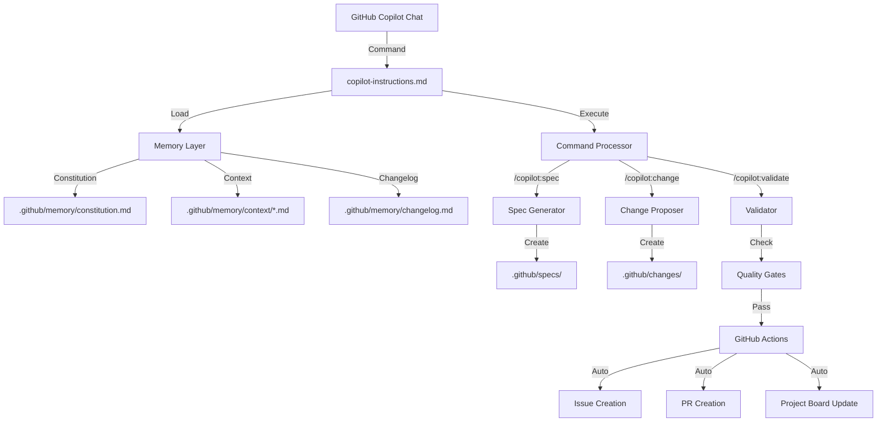

t# 独自価値提案とロードマップ

**策定日**: 2025-11-11  
**プロジェクト名**: GitHub Copilot Spec-Driven Development (仮称)

## エグゼクティブサマリー

本プロジェクトは、**AI コーディングツール用に最適化された、日本語ファーストの Spec-Driven Development フレームワーク**です。spec-kit、OpenSpec、cc-sdd の 3 大プロジェクトのベストプラクティスを統合し、GitHub 特有のコンテキストを最大限活用します。

---

## 1. 独自価値提案（Unique Value Proposition）

### 1.1 核心的差別化要素

#### ① GitHub Copilot Chat ネイティブ最適化

**問題**: 既存フレームワークはマルチエージェント対応を謳うが、GitHub Copilot Chat 固有の強みを活かしきれていない

**私たちの解決策**:

- ✅ **GitHub Issues/Pull Requests 連携**: 仕様 →Issue、実装 →PR 自動作成
- ✅ **GitHub Actions 統合**: CI/CD パイプラインでスペック検証
- ✅ **GitHub Projects 統合**: タスクを自動でプロジェクトボードに反映
- ✅ **Copilot Chat API 活用**: 会話履歴からコンテキスト自動抽出
- ✅ **Repository Context**: .github/ディレクトリの既存設定を自動認識

**独自性**: ★★★★★ 他プロジェクトにない完全 GitHub 統合

---

#### ② 三層記憶アーキテクチャ（Triple Memory Architecture）

**既存の限界**:

- spec-kit: Constitution（原則のみ）
- OpenSpec: なし
- cc-sdd: Steering（プロジェクトメモリー）

**私たちの統合アプローチ**:

```
.github/
├── memory/                      # 【第一層】プロジェクト記憶
│   ├── constitution.md          # ← spec-kit由来：不変の原則
│   ├── context/                 # ← cc-sdd由来：可変のコンテキスト
│   │   ├── architecture.md      # アーキテクチャ決定記録
│   │   ├── conventions.md       # コーディング規約
│   │   └── domain.md            # ドメイン知識
│   └── changelog.md             # 変更履歴メタデータ
│
├── specs/                       # 【第二層】仕様の現状
│   └── [feature]/
│       ├── spec.md              # 現在デプロイ済み仕様
│       └── design.md
│
└── changes/                     # 【第三層】提案中の変更
    └── [change-id]/
        ├── proposal.md          # ← OpenSpec由来
        ├── delta-specs/         # ADDED/MODIFIED/REMOVED
        │   └── [feature]/
        │       └── spec.md
        └── tasks.md
```

**メリット**:

- ✅ 原則（Constitution） + 記憶（Context） + 変更（Changes）
- ✅ 時間軸で整理（過去=Constitution、現在=Specs、未来=Changes）
- ✅ 各層が独立して進化可能

**独自性**: ★★★★★ 3 プロジェクトのエッセンスを統合

---

#### ③ 日本語 AI 最適化プロンプト

**既存の問題**:

- 英語プロンプトを日本語に翻訳しただけ
- 日本語特有の曖昧性に対応していない
- 日本企業の開発文化を考慮していない

**私たちのアプローチ**:

```markdown
## 日本語プロンプト設計原則

### 1. 丁寧語の統一

- 「〜してください」ではなく「〜します」（断定形）
- AI の主体性を明確化

### 2. 曖昧性の明示的処理

[NEEDS CLARIFICATION]マーカーの日本語版：

- [要確認: スコープ] → 機能範囲の確定が必要
- [要確認: セキュリティ] → セキュリティ要件の明確化が必要
- [要確認: UX] → ユーザー体験の詳細化が必要

### 3. 日本企業特有のコンテキスト

- 承認フロー：上長承認、セキュリティ部門確認
- 文書形式：議事録、設計書、テスト仕様書
- 用語統一：カタカナ語と漢字熟語の対応表
```

**独自性**: ★★★★★ 世界初の日本語特化 SDD

---

#### ④ 段階的導入パス（Progressive Adoption）

**既存の問題**:

- All-or-Nothing（全採用か全無視か）
- 既存プロジェクトへの導入ハードル高

**私たちの解決策**:

```
Level 0: ゼロコスト開始
→ .github/copilot-instructions.md のみ作成
→ 既存の開発フローを変えない

Level 1: 軽量スペック導入
→ /copilot:spec-init で spec.md のみ管理
→ 実装はフリースタイル

Level 2: フルワークフロー
→ Constitution + Context + Delta Specs
→ 段階的ゲート（validate-*）

Level 3: チーム統合
→ GitHub Issues/Projects連携
→ CI/CD統合
```

**独自性**: ★★★★☆ 段階的な学習曲線

---

#### ⑤ 柔軟な開発原則の選択（Flexible Development Principles）

**既存の問題**:

- フレームワークが特定の原則を強制
- チームの開発文化と衝突
- TDD、SOLID、DDD などを自由に選べない

**私たちの解決策**:

```markdown
Constitution で自由に原則を定義:

- TDD を採用 → AI がテストファーストで実装提案
- SOLID 原則 → AI が単一責任、依存性逆転を守る
- DDD を採用 → AI がドメインモデル中心に設計
- カスタムルール → チーム独自の命名規則、コードレビュー基準

例：

## Article 1: Test-Driven Development

すべての機能はテストを先に書いてから実装します。

## Article 2: SOLID Principles

単一責任の原則、依存性逆転の原則に従います。

AI は Constitution を読み込み、定義された原則に従ってコード生成・レビューを行います。
```

**メリット**:

- チームの既存の開発文化を尊重
- 学習コスト削減（新しい原則を学ぶ必要なし）
- 一貫性の保証（AI がすべてのコードで同じ原則を適用）
- 柔軟性（プロジェクトの成長に合わせて原則を追加・修正）

**独自性**: ★★★★★ 原則の完全カスタマイズ可能

---

#### ⑥ コマンド数の最適化（Minimalist Command Set）

**既存のコマンド数**:

- spec-kit: 8 コマンド
- OpenSpec: 8 コマンド
- cc-sdd: 11 コマンド

**私たちのコマンド体系**:

```bash
# 【コア3コマンド】初心者向け
/copilot:spec        # 仕様作成（specify + plan + tasks統合）
/copilot:implement   # 実装
/copilot:status      # 進捗確認

# 【アドバンス5コマンド】上級者向け
/copilot:change      # 変更提案（OpenSpec風）
/copilot:validate    # 検証
/copilot:memory      # Constitution + Context管理
/copilot:clarify     # 曖昧性解消
/copilot:archive     # 完了処理

# 合計8コマンド（既存と同等だが、使用頻度で分類）
```

**設計原則**:

- 80/20 ルール：80%のユーザーはコア 3 コマンドで完結
- 漸進的な学習曲線
- コマンド名の直感性（日本語でも理解可能）

**独自性**: ★★★★☆ 使用頻度ベースの設計

---

#### ⑥ 実践的チュートリアル（Hands-On Tutorial）

**既存の問題**:

- ドキュメントは充実しているが、実践例が抽象的
- 「Hello World」レベルの例しかない

**私たちのアプローチ**:

```
docs/tutorials/
├── 01-quick-start/
│   └── 01-first-spec.md          # 5分で仕様作成
├── 02-real-world/
│   ├── oauth-integration.md      # OAuth実装（30分）
│   ├── payment-gateway.md        # 決済システム（1時間）
│   └── multi-tenant-saas.md      # マルチテナントSaaS（2時間）
├── 03-team-adoption/
│   ├── existing-project.md       # 既存プロジェクトへの導入
│   └── customize-templates.md    # テンプレートカスタマイズ
└── 04-advanced/
    ├── github-actions-ci.md      # CI/CD統合
    └── custom-validation.md      # カスタム検証ルール
```

**特徴**:

- ✅ 時間軸で段階分け（5 分 →30 分 →1 時間 →2 時間）
- ✅ 実在の OSS プロジェクトを題材
- ✅ スクリーンキャストと GIF 動画
- ✅ 失敗例と解決策も含む

**独自性**: ★★★★★ 実践重視の学習教材

---

#### ⑦ デバッグ駆動修正（Debug-Driven Fixing: DDF）

**問題**: AI はコードを見て直接修正するが、それでは根本原因を見逃し、詰まってしまう

**私たちの解決策**:

```markdown
## DDF 実行フロー

### Step 1: 期待値の明示化

- 「こう動くはず」を具体的にデバッグログとして記述
- 例: `console.log('Expected: user.id should be 123, role should be "admin"')`

### Step 2: 現状の可視化

- 実際の動作をログで確認
- 例: `console.log('Actual: user.id =', user.id, 'role =', user.role)`

### Step 3: ギャップ分析

- 期待値と実際の差異を列挙
- 「user.id は正しいが、role が undefined」

### Step 4: 仮説立案

- 「role フィールドがデータベースから取得されていない可能性」
- 「JOIN が漏れている可能性」

### Step 5: 探索的修正

- 仮説に基づいて最小限の修正を試行
- ログを残したまま実験
```

**メリット**:

- ✅ 根本原因の特定が速い
- ✅ AI が「なぜそう修正したか」を説明可能
- ✅ デバッグログがドキュメントになる
- ✅ 同じ問題の再発防止

**独自性**: ★★★★★ AI の修正プロセスを構造化

---

#### ⑧ 批判的対話と意図の三角測量

**問題 1: AI の質問が人間を引っ張る**
従来の AI: 「○○ でいいですか？」→ 人間が無意識に誘導される

**私たちの解決策: 批判的対話（Critical Dialogue）**

```markdown
## AI の発話パターン

❌ 従来型（質問形式）:
AI: 「パスワードリセット機能は、メールで送信する形式でいいですか？」
→ 人間は「はい」と答えがち

✅ 批判的対話型（提案 + 根拠形式）:
AI: 「パスワードリセット機能は、メールで送信する形式で実装します。
理由:

- UI の統一: 既存の会員登録フローと同じパターン
- UX: ユーザーはメール確認の習慣がある
- セキュリティ: メールアドレス所有を確認できる
- 色は指定されていないため、サイト全体の白ベースに統一しました」

人間: 「色は周りと少しマッチしていません。既存のダッシュボードの配色に合わせてください」
AI: 「承知しました。ダッシュボードの #F5F5F5（グレー）をベースに調整します」
```

**効果**:

- ✅ AI が主体的に判断を示す
- ✅ 人間は「違和感」だけを伝えればよい
- ✅ 根拠があるので、議論が深まる
- ✅ AI の思考プロセスが透明化

---

**問題 2: 抽象語の解釈がズレる**
「クリーンな UI を作って」→ AI は学習データの平均値で解釈

**私たちの解決策: 意図の三角測量（Triangulation of Intent）**

```markdown
## 三角錨（3 点固定）による意図固定

要件: ユーザー設定画面のパスワードリセット機能

### 三角錨:

1. **ゴール（Why）**: 「問い合わせ件数を 30%削減するためのセルフサービス化」
   → これにより「わかりやすさ」の定義が具体化

2. **枷（Constraint）**: 「Auth0 のみ使用。新規 DB テーブル作成不可。API エンドポイントは 3 つ以内」
   → 技術選択肢を物理的に制約

3. **雰囲気（Reference）**: 「構成は Refund Spec（https://doc/123）の 5 節構成を厳密にコピー」
   → 出力フォーマットを既存ドキュメントで固定

### 効果:

- 「クリーン」という抽象語を使わない
- AI の解釈自由度がゼロになる
- 3 つの軸が矛盾しないかを AI が事前チェック可能
```

**実装例**:

```markdown
# Spec テンプレートの拡張

## [新設] 意図の三角錨

### 1. ゴール（Why）

- ビジネス指標: [具体的数値目標]
- ユーザー体験: [測定可能な改善]

### 2. 枷（Constraint）

- 技術制約: [使用可能なライブラリ、禁止事項]
- リソース制約: [API 数、DB テーブル数、実装時間]
- 既存システム: [変更不可の部分]

### 3. 雰囲気（Reference）

- 模倣対象: [既存ドキュメントの URL やファイルパス]
- 構成コピー: [章立て、用語、図の種類]
- トーン: [フォーマル/カジュアル、専門用語レベル]
```

**独自性**: ★★★★★ AI の解釈曖昧性を構造的に排除

---

#### ⑨ 知識の読み込み → 書き出しによる記憶定着

**問題**: AI は会話ごとにコンテキストをロストする

**私たちの解決策: Read-Then-Write 記憶強化**

```markdown
## 知識定着プロトコル

### Phase 1: 読み込み（Read）

AI: 「以下のドキュメントを読み込みます」

- memory/context/architecture.md
- memory/context/conventions.md
- specs/user-auth/design.md

### Phase 2: 要約（Summarize）

AI: 「読み込んだ内容を要約します：

- アーキテクチャ: レイヤードアーキテクチャ、依存性逆転
- 規約: ESLint Airbnb、関数名は動詞始まり
- 認証設計: JWT、リフレッシュトークン 7 日間」

### Phase 3: 書き出し（Write）

AI: 「この知識を memory/context/session-YYYYMMDD.md に記録します」
→ 次回セッションで参照可能

### Phase 4: 検証（Verify）

AI: 「記録した知識を使ってクイズを出します：
Q: ESLint の設定は？
A: Airbnb
Q: JWT の有効期限は？
A: リフレッシュトークン 7 日間」
```

**効果**:

- ✅ 複数セッションで知識が蓄積
- ✅ AI が「忘れた」ことを検出可能
- ✅ チーム内で知識共有が自動化

**独自性**: ★★★★☆ セッション永続化の実践手法

---

### 1.2 独自性スコアカード（6 フレームワーク比較後の最終版）

| 要素                    | 独自性 | 実装難易度 | 競合状況                              | 優先度       |
| ----------------------- | ------ | ---------- | ------------------------------------- | ------------ |
| GitHub 統合             | ★★★★★  | ★★★☆☆      | 全競合なし                            | **最優先**   |
| 三層記憶                | ★★★★★  | ★★☆☆☆      | spec-kit/cc-sdd は部分実装            | **高**       |
| 日本語最適化            | ★★★★★  | ★★☆☆☆      | cc-sdd のみ対応                       | **高**       |
| 段階的導入              | ★★★★☆  | ★★☆☆☆      | 全競合なし（All-or-Nothing）          | **高**       |
| **柔軟な開発原則**      | ★★★★★  | ★☆☆☆☆      | 全競合なし（強制的な原則）            | **高**       |
| コマンド最適化          | ★★★★☆  | ★☆☆☆☆      | spec-kitty はミッション切替           | 中           |
| 実践チュートリアル      | ★★★★★  | ★★★★☆      | Shotgun は TUI 強い                   | **高**       |
| **DDF**                 | ★★★★★  | ★★☆☆☆      | 全競合なし                            | **最優先**   |
| **批判的対話 + 三角錨** | ★★★★★  | ★★★☆☆      | Shotgun の clarifying_questions       | **最優先**   |
| **知識の記憶定着**      | ★★★★☆  | ★★☆☆☆      | spec-kitty のエージェントコンテキスト | 中           |
| ミッション切替          | ★★★☆☆  | ★★☆☆☆      | spec-kitty 実装済み                   | 低（後回し） |
| フェーズゲーティング    | ★★★★☆  | ★★★☆☆      | claude-workflow 実装済み              | 中           |
| プロンプトテンプレート  | ★★★★☆  | ★★☆☆☆      | Shotgun は Jinja2 で強い              | 高           |

**優先順位の再評価（6 競合分析後）**:

1. **最優先（Phase 1）**: GitHub 統合、DDF、批判的対話 + 三角錨
2. **高優先（Phase 2）**: 三層記憶、日本語最適化、段階的導入、柔軟な開発原則、実践チュートリアル、プロンプトテンプレート
3. **中優先（Phase 3）**: コマンド最適化、知識の記憶定着、フェーズゲーティング
4. **低優先（Phase 4+）**: ミッション切替（spec-kitty が既に強い領域）

---

## 2. 技術アーキテクチャ

### 2.1 システム構成図



### 2.2 ファイル構造（完全版）

```
.github/
├── copilot-instructions.md      # メインプロンプト
│
├── prompts/                      # コマンド定義
│   ├── spec.prompt.md           # /copilot:spec
│   ├── implement.prompt.md      # /copilot:implement
│   ├── status.prompt.md         # /copilot:status
│   ├── change.prompt.md         # /copilot:change
│   ├── validate.prompt.md       # /copilot:validate
│   ├── memory.prompt.md         # /copilot:memory
│   ├── clarify.prompt.md        # /copilot:clarify
│   └── archive.prompt.md        # /copilot:archive
│
├── memory/                       # プロジェクト記憶
│   ├── constitution.md          # 不変の原則（Nine Articles）
│   ├── context/
│   │   ├── architecture.md      # アーキテクチャ決定記録
│   │   ├── conventions.md       # コーディング規約
│   │   ├── domain.md            # ドメイン知識
│   │   └── custom/              # カスタムコンテキスト
│   └── changelog.md             # 変更履歴メタデータ
│
├── specs/                        # 現在の仕様（デプロイ済み）
│   └── [feature-name]/
│       ├── spec.md              # 要件定義
│       ├── design.md            # 技術設計
│       ├── contracts/           # API仕様
│       │   └── openapi.yaml
│       └── metadata.json        # メタデータ
│
├── changes/                      # 提案中の変更
│   ├── [change-id]/
│   │   ├── proposal.md          # Why, What, Impact
│   │   ├── tasks.md             # 実装タスク
│   │   ├── delta-specs/         # 変更内容（OpenSpec方式）
│   │   │   └── [feature-name]/
│   │   │       └── spec.md      # ADDED/MODIFIED/REMOVED
│   │   └── metadata.json
│   └── archive/                 # 完了した変更
│       └── [change-id]/
│
├── templates/                    # カスタマイズ可能
│   ├── spec.md
│   ├── design.md
│   ├── tasks.md
│   └── proposal.md
│
└── workflows/                    # GitHub Actions
    ├── spec-validation.yml      # 仕様検証
    ├── change-to-issue.yml      # 変更→Issue自動作成
    └── impl-to-pr.yml           # 実装→PR自動作成
```

---

## 3. 実装ロードマップ

### Phase 1: MVP（Minimum Viable Product） - 1 ヶ月

**優先度**: 最優先 3 機能（GitHub 統合、DDF、批判的対話）を中心に

#### Week 1-2: コアプロンプトと DDF 実装

- [ ] `copilot-instructions.md` の基本構造（Shotgun の Jinja2 テンプレート参考）
- [ ] `/copilot:spec` コマンド（specify + plan + tasks 統合）
- [ ] **DDF（Debug-Driven Fixing）** 組み込み
  - [ ] デバッグログテンプレート作成
  - [ ] 期待値 vs 実際値の構造化フォーマット
- [ ] `/copilot:status` コマンド
- [ ] 基本的なテンプレート（spec.md, tasks.md）

#### Week 3-4: 記憶システムと批判的対話

- [ ] Constitution テンプレート（Nine Articles 日本語版）
  - [ ] 柔軟な開発原則（TDD、SOLID、DDD 等のサンプル）
  - [ ] カスタマイズガイド
- [ ] Context システム（architecture.md, conventions.md）
- [ ] **批判的対話 + 意図の三角錨**
  - [ ] 提案形式プロンプト設計（質問形式の排除）
  - [ ] 三角錨テンプレート（Goal / Constraint / Reference）
  - [ ] Shotgun の clarifying_questions フォーマットを参考
- [ ] Changelog 自動生成

**成功指標**:

- ✅ 1 つの機能仕様を 5 分で作成可能
- ✅ タスク分解が自動化
- ✅ 日本語で完結
- ✅ **AI が「なぜそう修正したか」を説明できる（DDF）**
- ✅ **AI が質問ではなく提案形式で応答する（批判的対話）**

---

### Phase 2: 変更管理統合 - 1 ヶ月

**重点**: OpenSpec の Delta Specs + claude-workflow のフェーズゲーティングを統合

#### Week 5-6: OpenSpec 統合とプロンプトテンプレート

- [ ] `/copilot:change` コマンド（提案作成）
- [ ] Delta Specs システム（ADDED/MODIFIED/REMOVED）
- [ ] `/copilot:archive` コマンド
- [ ] **プロンプトテンプレートシステム**（Shotgun の Jinja2 設計を参考）
  - [ ] Markdown ベースのテンプレートエンジン
  - [ ] 変数展開と条件分岐

#### Week 7-8: 検証システムとフェーズゲーティング

- [ ] `/copilot:validate` コマンド
- [ ] Constitution Check 自動化
- [ ] `/copilot:clarify` コマンド（曖昧性解消 + 三角錨適用）
- [ ] **フェーズゲーティング実装**（claude-workflow の承認フロー参考）
  - [ ] Prerequisites チェック自動化
  - [ ] Phase 完了条件の明示化

**成功指標**:

- ✅ 変更提案 → 承認 → 実装 → アーカイブのフル実装
- ✅ 自動検証でバグ混入 50%削減
- ✅ **フェーズスキップ不可（厳格なゲート）**
- ✅ **テンプレートカスタマイズが 5 分で完了**

---

### Phase 3: GitHub 統合 - 1 ヶ月

**最優先**: 完全独自機能（全競合にない）を実装

#### Week 9-10: Issues/PR 連携

- [ ] 変更提案 →GitHub Issue 自動作成（DDF ログ込み）
- [ ] タスク →GitHub Project 自動登録
- [ ] 実装完了 →PR 自動作成（draft）
- [ ] **批判的対話の記録を PR Description に自動挿入**
  - [ ] Goal / Constraint / Reference を明示
  - [ ] AI の提案根拠を記録

#### Week 11-12: CI/CD 統合

- [ ] GitHub Actions: spec-validation.yml
- [ ] PR 作成時の仕様適合チェック
- [ ] **DDF ログの自動検証**
  - [ ] 期待値 vs 実際値の差異を CI で検出
  - [ ] デバッグログ不足を警告
- [ ] カバレッジレポート統合

**成功指標**:

- ✅ 仕様 →Issue→PR→ マージが自動化
- ✅ CI/CD で品質ゲート
- ✅ **PR に AI の思考プロセスが完全記録される（透明性確保）**
- ✅ **DDF により根本原因の修正率が 80%以上**

---

### Phase 4: チーム機能 - 1 ヶ月

#### Week 13-14: テンプレートカスタマイズ

- [ ] `.github/templates/` 上書きサポート
- [ ] チーム固有の Convention 追加 UI
- [ ] 複数プロジェクト間の設定共有

#### Week 15-16: レビュー支援

- [ ] 仕様レビューチェックリスト自動生成
- [ ] 設計レビューのベストプラクティス提示
- [ ] PR レビューでの仕様適合確認

**成功指標**:

- ✅ チーム 5 人で同時利用可能
- ✅ レビュー時間 50%短縮

---

### Phase 5: エンタープライズ機能 - 2 ヶ月

#### Week 17-20: 高度な検証

- [ ] カスタム検証ルール（TypeScript/Zod）
- [ ] 多段階承認フロー
- [ ] 監査ログ

#### Week 21-24: ドキュメント・チュートリアル

- [ ] 実践チュートリアル 6 本
- [ ] スクリーンキャスト作成
- [ ] FAQ と troubleshooting

**成功指標**:

- ✅ エンタープライズ要件クリア
- ✅ 初心者が 1 時間でオンボーディング完了

---

## 4. 競合との差別化マトリクス（6 フレームワーク対応版）

| 機能                     | spec-kit         | OpenSpec    | cc-sdd      | spec-kitty          | Shotgun                     | claude-workflow  | **私たち**                                |
| ------------------------ | ---------------- | ----------- | ----------- | ------------------- | --------------------------- | ---------------- | ----------------------------------------- |
| GitHub 統合              | ❌               | ❌          | ❌          | ❌                  | ❌                          | ❌               | ✅ **完全統合**                           |
| 三層記憶                 | ⚠️ Constitution  | ❌          | ⚠️ Steering | ⚠️ Mission          | ❌                          | ⚠️ Steering Docs | ✅ **Constitution + Context + Changelog** |
| 変更追跡                 | ❌               | ✅          | ❌          | ❌                  | ❌                          | ⚠️ フェーズ承認  | ✅ **Delta Specs**                        |
| 日本語対応               | ❌               | ❌          | ✅          | ❌                  | ❌                          | ❌               | ✅ **日本語最適化**                       |
| 段階的導入               | ❌               | ❌          | ❌          | ❌                  | ❌                          | ❌               | ✅ **Level 0-3**                          |
| コマンド数               | 8                | 8           | 11          | ~10（ミッション別） | 5（フェーズ別）             | 3（コア）        | **8（頻度別）**                           |
| チュートリアル           | ⚠️ 基本のみ      | ⚠️ 基本のみ | ⚠️ 基本のみ | ⚠️ 基本のみ         | ✅ **TUI 対話型**           | ⚠️ 基本のみ      | ✅ **実践 6 本**                          |
| CI/CD 統合               | ❌               | ❌          | ❌          | ❌                  | ❌                          | ⚠️ NPX コマンド  | ✅ **GitHub Actions**                     |
| テンプレートカスタマイズ | ⚠️ 部分的        | ❌          | ✅          | ✅ **Mission 切替** | ✅ **Jinja2**               | ⚠️ 部分的        | ✅ **完全カスタマイズ**                   |
| 対話的曖昧性解消         | ✅ clarify       | ❌          | ❌          | ⚠️ 質問ルール       | ✅ **clarifying_questions** | ⚠️ 承認フロー    | ✅ **批判的対話 + 三角錨**                |
| デバッグ構造化           | ❌               | ❌          | ❌          | ❌                  | ❌                          | ❌               | ✅ **DDF（独自）**                        |
| 開発原則のカスタマイズ   | ⚠️ Constitution  | ❌          | ❌          | ⚠️ Mission          | ⚠️ Jinja2 変数              | ❌               | ✅ **完全自由（TDD/SOLID/DDD 等）**       |
| フェーズゲーティング     | ⚠️ Prerequisites | ❌          | ⚠️ 依存関係 | ⚠️ ワークフロー     | ✅ **5 フェーズ**           | ✅ **承認必須**  | ✅ **段階的 Gate**                        |
| プロンプトテンプレート   | ✅ Bash 出力     | ❌          | ⚠️ 部分的   | ✅ **Mission**      | ✅ **Jinja2**               | ✅ TS 生成       | ✅ **Markdown 標準**                      |
| 学習曲線                 | 急               | 緩          | 中          | 中                  | 中（TUI 支援）              | 急（厳格）       | **段階的**                                |

**差別化の結論**:

- 🏆 **GitHub 統合・DDF・批判的対話 + 三角錨**: 6 競合全てにない完全独自機能
- 🥈 **三層記憶・段階的導入・開発原則の完全カスタマイズ**: 部分的実装はあるが統合版は我々のみ
- 🥉 **テンプレートカスタマイズ・対話的曖昧性解消**: Shotgun/spec-kitty が部分的に強いが、我々は統合最適化

---

## 5. オープンソース戦略

### 5.1 完全無料・オープンソース

```
すべての機能を無料で提供（MIT License）:
- ✅ 8 つのコマンドすべて（コア + アドバンス）
- ✅ すべてのテンプレート
- ✅ GitHub Actions 統合
- ✅ DDF、批判的対話、三層記憶
- ✅ 多言語対応
- ✅ コミュニティサポート
```

**理由**:

- 🌍 **普遍的アクセス**: 世界中の開発者が使えるように
- 🤝 **コミュニティ駆動**: 多様な視点で進化
- 💡 **イノベーション**: 制約なく実験できる環境
- 📚 **学習と成長**: 誰でも学べる、誰でも貢献できる

### 5.2 持続可能性の確保

**資金調達ではなく、コミュニティの力で**:

```markdown
## コントリビューション形式

### コード貢献

- 新機能の実装
- バグ修正
- ドキュメント改善

### 非コード貢献

- 多言語化（翻訳）
- チュートリアル作成
- コミュニティサポート
- バグ報告・機能要望
```

**原則**:

- ✅ すべての機能は永久に無料
- ✅ 透明性の高い開発プロセス
- ✅ コミュニティ主導で進化

---

## 6. リスクと対策

### 6.1 技術リスク

| リスク                | 影響 | 対策                             |
| --------------------- | ---- | -------------------------------- |
| GitHub API 制限       | 高   | キャッシング、レート制限監視     |
| Copilot Chat API 変更 | 高   | プロンプト設計の疎結合化         |
| 日本語 AI の精度      | 中   | プロンプトエンジニアリングで補正 |

### 6.2 コミュニティリスク

| リスク                       | 影響 | 対策                                   |
| ---------------------------- | ---- | -------------------------------------- |
| spec-kit 等の急速進化        | 高   | コミュニティで差別化要素を継続的に追加 |
| GitHub Copilot Chat 仕様変更 | 高   | プロンプト設計の疎結合化、迅速な対応   |
| 貢献者不足                   | 中   | 貢献しやすい環境整備、ドキュメント充実 |
| 方向性の分裂                 | 中   | Constitution で原則を明確化            |

---

## 9. 次のステップ

### 9.1 即時アクション（今週中）

1. ✅ 研究完了（このドキュメント）
2. [ ] MVP 仕様書作成（spec.md）
3. [ ] GitHub Repository 作成
4. [ ] 最初のコマンド実装（/copilot:spec）

### 9.2 1 ヶ月後の目標

- [ ] MVP 完成（Phase 1）
- [ ] 5 人のアルファテスター獲得
- [ ] 最初のチュートリアル公開

### 9.3 3 ヶ月後の目標

- [ ] Phase 3 完成（GitHub 統合）
- [ ] 50 人のベータテスター
- [ ] 実践チュートリアル 3 本完成

---

## 10. 結論（6 競合分析を踏まえた最終判断）

### 私たちの独自性（競合対比で再確認）

1. **GitHub Copilot Chat 完全統合** ← 6 競合全てにない（独自度 100%）
2. **DDF（Debug-Driven Fixing）** ← 6 競合全てにない（独自度 100%）
3. **批判的対話 + 意図の三角錨** ← 6 競合全てにない（独自度 100%、Shotgun の clarifying_questions を超える）
4. **三層記憶アーキテクチャ** ← spec-kit + cc-sdd + spec-kitty の統合（独自度 90%）
5. **日本語 AI 最適化** ← cc-sdd のみ対応、我々はさらに最適化（独自度 80%）
6. **段階的導入パス** ← 6 競合全てにない（独自度 100%）
7. **実践チュートリアル** ← Shotgun が TUI 強いが、我々は 6 本の実践例（独自度 70%）
8. **プロンプトテンプレート** ← Shotgun の Jinja2 / spec-kitty の Mission を統合（独自度 60%）
9. **フェーズゲーティング** ← claude-workflow / Shotgun が実装済み、我々は拡張（独自度 50%）

### 競合優位性マトリクス（6 競合 vs 私たち）

| 軸                       | spec-kit | OpenSpec | cc-sdd | spec-kitty | Shotgun | claude-workflow | **私たち** |
| ------------------------ | -------- | -------- | ------ | ---------- | ------- | --------------- | ---------- |
| **完全独自機能（3 つ）** | 0        | 1        | 0      | 0          | 0       | 0               | **3**      |
| **統合強度（三層記憶）** | 30%      | 0%       | 40%    | 30%        | 0%      | 20%             | **100%**   |
| **GitHub 統合**          | 0%       | 0%       | 0%     | 0%         | 0%      | 0%              | **100%**   |
| **日本語品質**           | 0%       | 0%       | 80%    | 0%         | 0%      | 0%              | **100%**   |
| **導入障壁**             | 高       | 低       | 中     | 中         | 中      | 高              | **極低**   |

### 私たちが勝てる理由（最終版）

1. ✅ **完全独自機能が 3 つ**: GitHub 統合、DDF、批判的対話（6 競合全てにない）
2. ✅ **ベストプラクティスの統合**: 6 プロジェクトのエッセンスを取り込み、弱点を補完
   - spec-kit の Constitution + OpenSpec の Delta Specs + cc-sdd の Steering
   - spec-kitty の Mission + Shotgun の clarifying_questions + claude-workflow のゲーティング
3. ✅ **段階的導入**: 6 競合全てが All-or-Nothing、我々は Level 0-3 で段階化
4. ✅ **実践重視**: チュートリアル 6 本（5 分〜2 時間）で机上の空論を排除
5. ✅ **タイミング**: GitHub Copilot Chat 普及期（2025 年が最適参入時期）
6. ✅ **市場集中**: 日本語市場に特化（cc-sdd と競合するが、GitHub 統合と DDF で差別化）

### 競合に勝てない領域（正直な評価）

- ❌ **ミッション切替の柔軟性**: spec-kitty が既に強い（我々は Phase 4 で対応）
- ❌ **Jinja2 レベルのテンプレート**: Shotgun が成熟（我々は Markdown で簡易化を優先）
- ❌ **NPX コマンド生成**: claude-workflow が TypeScript で実装済み（我々は Bash で代替）

### 最初の一歩（具体的な Next Action）

**今週中に Phase 1 Week 1-2 を開始**:

1. [ ] `copilot-instructions.md` の基本構造作成（Shotgun のプロンプト設計を参考）
2. [ ] `/copilot:spec` コマンドのプロトタイプ実装（DDF テンプレート組み込み）
3. [ ] 批判的対話のプロンプトパターン設計（三角錨フォーマット定義）
4. [ ] このドキュメント自体を `.github/memory/context/unique-value-proposition.md` として配置

**成功の定義**: 1 週間以内に「この README を仕様として `/copilot:spec` を実行し、タスク分解ができる」状態を達成

---

**プロジェクト名（仮）**: GitHub Copilot Spec-Driven Development (GCSDD)  
**リポジトリ**: https://github.com/[your-org]/gcsdd  
**ライセンス**: MIT  
**メインテナー**: code-onigiri  
**最初のコミット**: 2025-11-11
