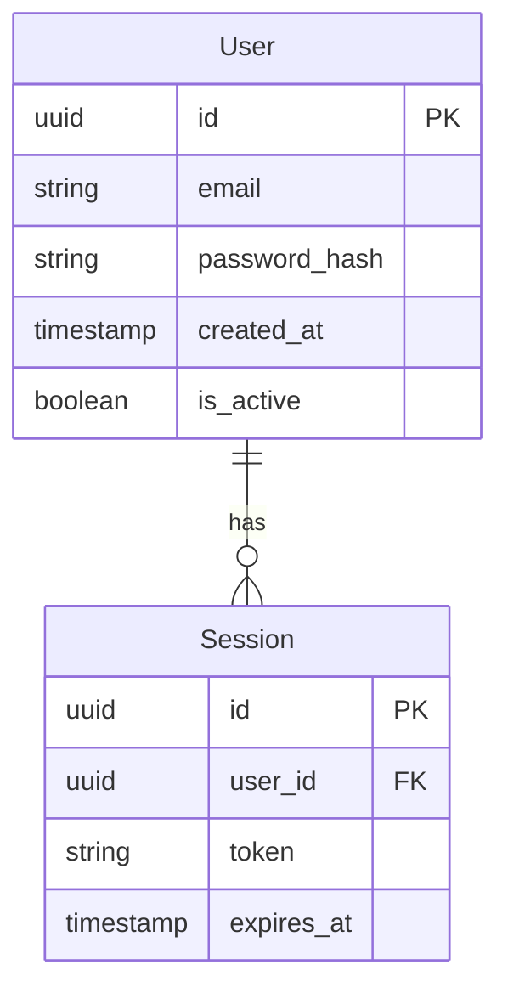

# /ikak:plan Command

Generate a comprehensive implementation plan from a feature specification.

## User Input

```text
$ARGUMENTS
```

You **MUST** consider the user input before proceeding (if not empty).

## Purpose

Transform a feature specification into a detailed implementation plan including:

- Technical context and stack decisions
- Research for unknowns
- Data model design
- API contracts
- Project structure

## Prerequisites

- `/specs/[###-feature-name]/spec.md` must exist
- Run `/ikak:specify` first if spec doesn't exist

## Execution Flow

### Setup

1. Run setup script to get paths:
   ```bash
   bash .specify/scripts/setup-plan.sh "[###-feature-name]"
   ```
2. Parse output for:
   - FEATURE_SPEC: Path to spec.md
   - IMPL_PLAN: Path to plan.md (already created from template)
   - SPECS_DIR: Feature directory
   - BRANCH: Git branch name

### Phase 0: Outline & Research

1. **Load Context**:

   - Read FEATURE_SPEC
   - Read `/memory/constitution.md` (if exists)
   - Read IMPL_PLAN template

2. **Fill Technical Context**:

   - Language/Version: Determine from user input or mark NEEDS CLARIFICATION
   - Primary Dependencies: List main frameworks/libraries
   - Storage: Database/storage solution or N/A
   - Testing: Test framework choice
   - Target Platform: Where this will run
   - Project Type: single/web/mobile
   - Performance Goals: Specific metrics from spec

3. **Constitution Check** (if /memory/constitution.md exists):

   - Evaluate against project principles
   - Document any violations and justification
   - ERROR if violations cannot be justified

4. **Extract Unknowns**:

   - Identify all NEEDS CLARIFICATION items
   - For each unknown → research task
   - For each technology choice → best practices task

5. **Generate research.md**:
   - For each unknown: Research and document decision
   - Format:
     - Decision: [what was chosen]
     - Rationale: [why chosen]
     - Alternatives considered: [what else evaluated]
   - Resolve ALL NEEDS CLARIFICATION items

**Output**: `research.md` with all unknowns resolved

**Checkpoint**: All technical decisions made ✓

### Phase 1: Design & Contracts

**Prerequisites**: `research.md` complete

1. **Generate data-model.md**:

   - Extract entities from functional requirements
   - For each entity:
     - Name and description
     - Fields with types
     - Relationships to other entities
     - Validation rules
     - State transitions (if applicable)
   - Include ER diagram (Mermaid format)

2. **Generate API Contracts** (`contracts/`):

   - For each user action → endpoint
   - Use OpenAPI/GraphQL schema format
   - Include:
     - Endpoint path and method
     - Request schema
     - Response schema (success and error)
     - Authentication requirements
     - Rate limiting
   - Create `contracts/api-spec.json` or `contracts/api-spec.yaml`

3. **Generate quickstart.md**:

   - Example usage scenarios from spec
   - Integration examples
   - Common workflows

4. **Define Project Structure**:

   - Choose structure based on project type:
     - Single project: `src/`, `tests/`
     - Web app: `backend/`, `frontend/`
     - Mobile: `api/`, `ios/`or `android/`
   - Document actual directory layout
   - Remove unused options from template

5. **Re-evaluate Constitution Check**:
   - Check design against principles
   - Update complexity tracking if needed

**Output**: `data-model.md`, `contracts/`, `quickstart.md`, updated `plan.md`

**Checkpoint**: Design complete, ready for task breakdown ✓

### Phase 2: Finalize Plan

1. **Fill Implementation Phases Section**:

   - Document Phase 0 results
   - Document Phase 1 results
   - Define Phase 2 (task breakdown) expectations

2. **Add Implementation Notes**:

   - Any constraints or considerations
   - Integration points
   - Migration strategy (if applicable)

3. **Document Risks**:

   - Technical risks
   - Impact and probability
   - Mitigation strategies

4. **Save Complete Plan**:
   - Ensure all template sections filled
   - No [PLACEHOLDER] or [TODO] markers remain
   - Update date and branch info

## Output

- `/specs/[###-feature-name]/plan.md` - Complete implementation plan
- `/specs/[###-feature-name]/research.md` - Technical decisions
- `/specs/[###-feature-name]/data-model.md` - Entity definitions
- `/specs/[###-feature-name]/contracts/` - API specifications
- `/specs/[###-feature-name]/quickstart.md` - Usage examples

## Key Rules

- Use absolute paths
- ERROR on gate failures or unresolved clarifications
- All NEEDS CLARIFICATION must be resolved in research.md
- Data model must map to spec requirements
- API contracts must cover all user stories

## Next Steps

After plan is complete, user should run:

- `/ikak:tasks` - To break down into implementation tasks
- `/ikak:checklist` - To generate quality checklist (optional)

## Example Research.md

```markdown
# Research: User Authentication

## Decision: Password Hashing

**Decision**: Use bcrypt for password hashing

**Rationale**:

- Industry standard for password storage
- Adaptive cost factor (futureproof against hardware improvements)
- Built-in salt generation
- Well-tested Python implementation available

**Alternatives Considered**:

- PBKDF2: Simpler but less resistant to GPU attacks
- Argon2: More secure but newer, less ecosystem support
- scrypt: Good but bcrypt more widely adopted

## Decision: Session Management

[Continue for each decision...]
```

## Example Data-Model.md

````markdown
# Data Model: User Authentication

## Entities

### User

**Description**: Represents a registered user account

**Fields**:

- id: UUID (primary key)
- email: String (unique, indexed, max 255 chars)
- password_hash: String (60 chars, bcrypt)
- created_at: Timestamp
- updated_at: Timestamp
- is_active: Boolean (default true)
- is_verified: Boolean (default false)

**Relationships**:

- Has many: Sessions

**Validation**:

- Email must be valid format
- Password must be minimum 8 characters
- Email must be unique

**State Transitions**:

- Created (is_verified=false) → Verified (is_verified=true) → Active (is_active=true)
- Active → Inactive (is_active=false)

### Session

[Continue for other entities...]

## ER Diagram


````

```

```
